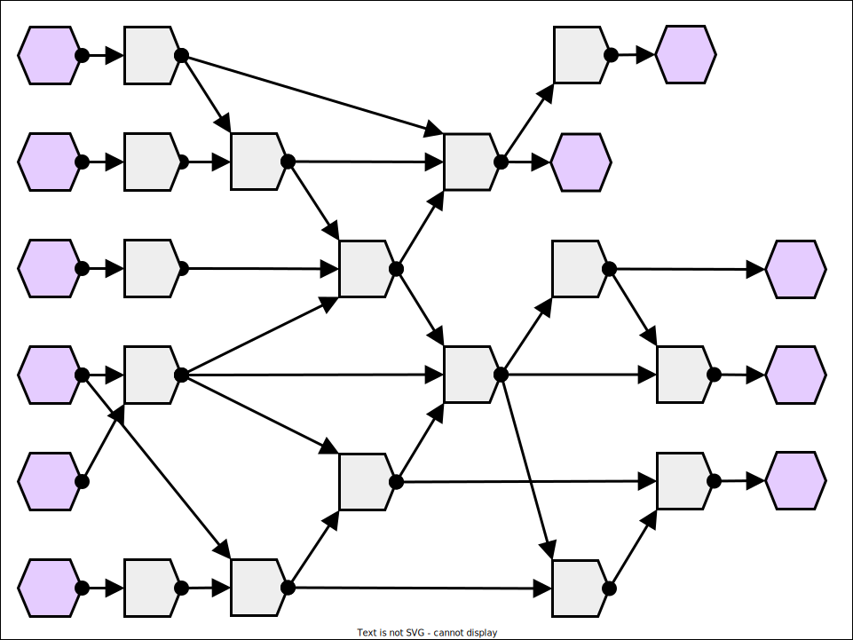
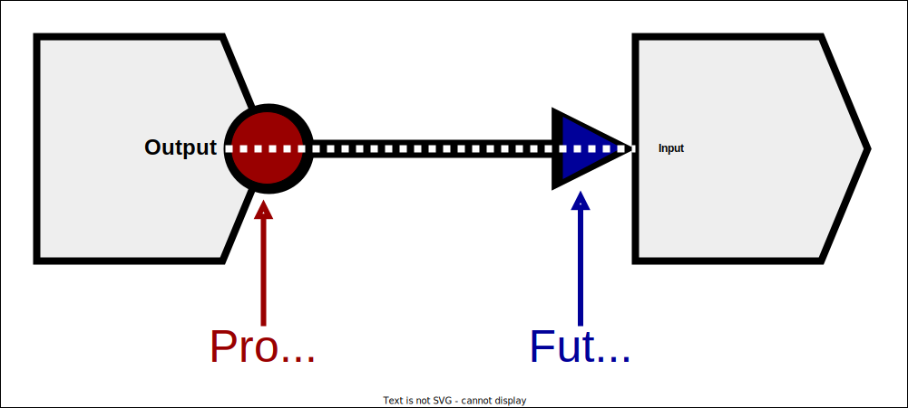

# The Basics

As noted in [the shape of a problem chapter](../shape/graphs.md), the execution of a program can be broken down into a directed acyclic graph of dependencies between operations.

<div style="width: 50%; margin: auto;">


</div>

When these dependency relationships cross between thread/process boundaries, the dependents need to wait until the dependency is resolved.
In [the synchronization sub-chapter](../shared_mem/sync.md) of the shared memory chapter, we covered the various synchronization primitives that allow threads to manage these timing requirements.
While these primitives are powerful, they cannot always ensure that the resources they represent are properly used.

Even if a condition is included in the definition of a program, and even if the developer intends to use the condition to manage a dependency, that condition does nothing if it is not actually waited upon.
As always, shared memory parallelism gives the developer more freedom and more hazards to worry about.

On the other hand, message passing parallelism offers a safer alternative, but many developers prefer flexibility over safety.

As a compromise between these approaches, many libraries and languages allow developers to use message passing capabilities to communicate between threads.
While they do not fit every use case, these capabilities offer a cheap, safe, and effective way to manage a variety of concurrent problems.

At the core of these capabilities are three powerful tools:
- Promises
- Futures
- Asynchronous calls


## Promises and Futures

Within a program's dependency graph, the dependencies between operations can be thought of as message channels.
Under this model, once an operation completes, a message is sent to all other operations that depended upon it, conveying that the operation completed as well as any relevant output from that operation.
Once an operation has received a message from every operation it depends upon, it can then safely execute.

Promises and futures represent the sending and receiving ends of such a message channel.
After an operation completes, it can give its output to a promise, and that promise can convey this output to all associated futures.
Likewise, before an operation begins, it may query a future corresponding to each of its dependencies, with each query blocking until the corresponding future receives information from its promise.

<div style="width: 80%; margin: auto;">


</div>

Previously, in [the synchronization sub-chapter](../shared_mem/sync.md) of the shared memory chapter, this example of condition variables was shown:

```cpp
{{#include ../shared_mem/sync/condition_demo.cpp}}
```

In this example, the input/output provided to each thread, in combination with a condition, acted as a sort of message channel.
The content of the message was conveyed by the storage pointed by the input/output variable, and the sending of the message was communicated through the condition.

Below is a refactored version of this example, that uses a promise and future in place of these arguments.

```cpp
{{#include ./code/intro.cpp}}
```

## Asynchronous Calls

While promises are important, most developers do not interact with them directly.
Instead, the management of promises as well as the act of submitting output to them is usually delegated through an **asynchronous call**.

An asynchronous call is a function call that does not immediately evaluate the body of the called function.
Instead of directly returning the output of the call, a future representing that eventual output is produced.


Here is a refactored version of the previously shown promise/future example, with the explicit promise instance replaced by an asynchronous call:

```cpp
{{#include ./code/async.cpp}}
```

Notice that no thread is explicitly created either.
While an async call does not necessarily guarantee that the called function will be evaluated in a different thread, such calls often are.
The next sub-chapter will cover this in more detail, including how to control the spawning of threads for async calls.


## Shared Futures

Often, developers want to convey the output of one async function call to more than one function.
For example, consider this modified version of the example function, which has two threads, each performing a different action with the same input future.


```cpp
{{#include ./code/async_shared_bad.cpp}}
```

While this program seems correct, it will likely crash if it is run:

```console
$ ./async_shared
The output is 36288289
The input plus 1 is 36288290
Segmentation fault (core dumped)
```

The reason why this program crashes is due to the design of the `future` type provided by the C++ standard library.
In order to convey information and synchronize between threads, futures must hold some internal state, and that internal state takes up resources.
To make asynchronous processing more efficient, the C++ standard library implements a low-overhead `future` that can only have its `get` method called once after being assigned by a promise or async call.
After processing a `get` call, subsequent `get` calls will throw an error until the future is assigned a new valid state.
This limitation allows the future to clean up its internal state and release associated resources once the `get` method call is resolved.

While light-weight and efficient, this default `future` type cannot be effectively shared between threads.
To meet this need, the C++ standard library also includes a `shared_future` type, which maintains the internal state of the future in a thread-safe, reference counted manner.
Any valid instance of `future` may be converted to a `shared_future` via the `share` method.

```cpp
{{#include ./code/async_shared_unmoved.cpp}}
```


## Futures and Movement

Thusfar, the examples shown have passed futures by pointer.
This is done to hide an unintuitive aspect of C++ std `future`.
It cannot be copy-assigned.

To demonstrate, if the previously shown single-future example is refactored to pass `value_fut` directly:

```cpp
{{#include ./code/async_unmoved.cpp}}
```
`g++` emits the following error text:

<div style="height: 20em; overflow: scroll;">

```console
{{#include ./code/unmoved_out}}
```
</div>

This long block of error text is trying to communicate that the templates defining the `future` type do not provide a way to copy a `future`.
In fact, this capability is intentionally deleted.

The C++ std library does not allow `future` instances to be copied because they are only meant to return each valid result once.
If copying was allowed, then copies of a future would have to track shared ownership of the original internal state in order to coordinate whether or not the future has already been claimed.
This shared ownership would make `shared_future` semi-redundant and it would also increase the overhead of normal futures.

However, while a `future` may not be copied, it can be `move`-d.
Calling `std:move` on a future removes the shared state on the input future and returns a new future holding that removed state.
This preserves the assumptions that make `future` computationally cheap - that an instance either has sole ownership of a valid internal state, or that has no such ownership.

Here is a refactored version of the single-future example, using `move`:

```cpp
{{#include ./code/async_moved.cpp}}
```

On a similar note, `shared_future` already tracks shared ownership of the states they hold, and so it is safe to pass copies of them around to different threads.
The shared ownership is tracked with a thread-safe reference counter, so the held state will be automatically garbage collected upon the destruction of the last instance holding that state.

Here is a refactored version of the multiple-future example, passing by-value instead of by-pointer:


```cpp
{{#include ./code/async_shared.cpp}}
```


