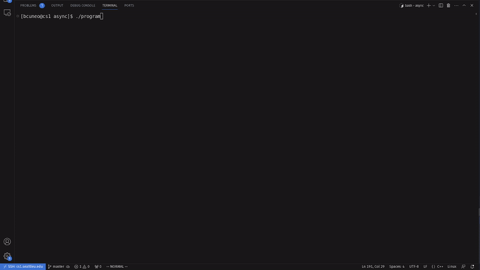
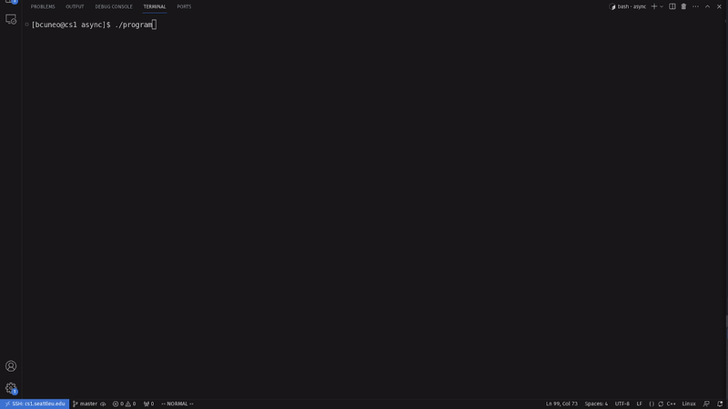

# Lazy Evaluation


## A Toy Problem: 1D Cellular Automata


## Evaluation Strategy

### Default


### Async



This is essentially a fork bomb.


### Deferred


### Deferred + Manual Multithreading

```cpp
// (inside main)

// Request the final states of all cells, using a unique
// thread per request
std::thread team[width];
for(size_t i=0; i<width; i++){
    team[i] = std::thread([&sim,i]{sim.query(i,gen_count-1);});
}
for(size_t i=0; i<width; i++){
    team[i].join();
}
```


## Order of Evaluation

### Left to Right

```cpp
// (inside AsyncCellSim::async_cell)
unsigned char index = (left.get() << 2) | (middle.get() << 1) | right.get();
```


### Right to Left

```cpp
// (inside AsyncCellSim::async_cell)
unsigned char index = right.get() | (middle.get() << 1) | (left.get() << 2);
```


### Middle, then Left, then Right

```cpp
// (inside AsyncCellSim::async_cell)
unsigned char index = (middle.get() << 1) | (left.get() << 2) | right.get();
```


*This is what happens.*


### Random?

```cpp
// (inside AsyncCellSim::async_cell)
unsigned char index;
switch(rand()%3) {
    case 0 :
        index = (left.get() << 2) | (middle.get() << 1) | right.get();
        break;
    case 1 :
        index = right.get() | (middle.get() << 1) | (left.get() << 2);
        break;
    default:
        index = (middle.get() << 1) | (left.get() << 2) | right.get();
}
```




### Polling