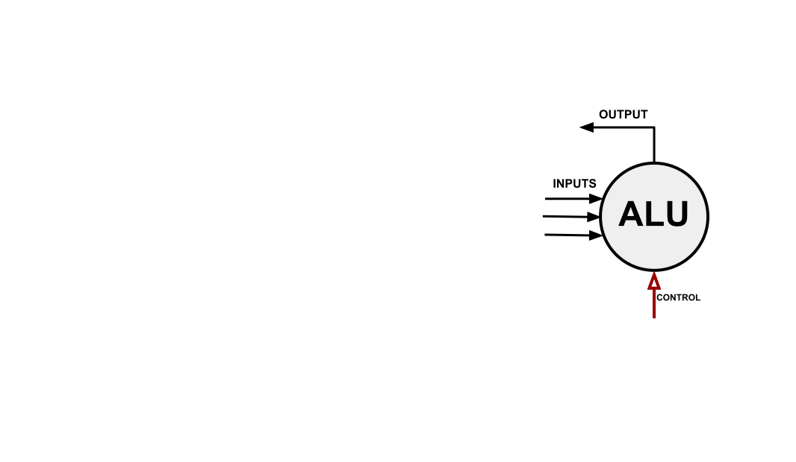
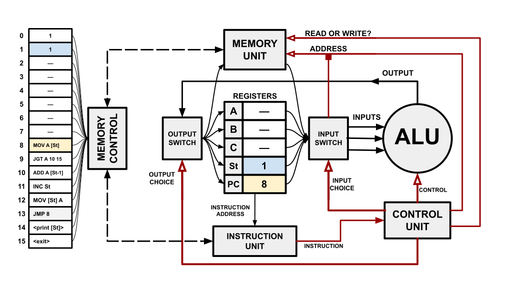
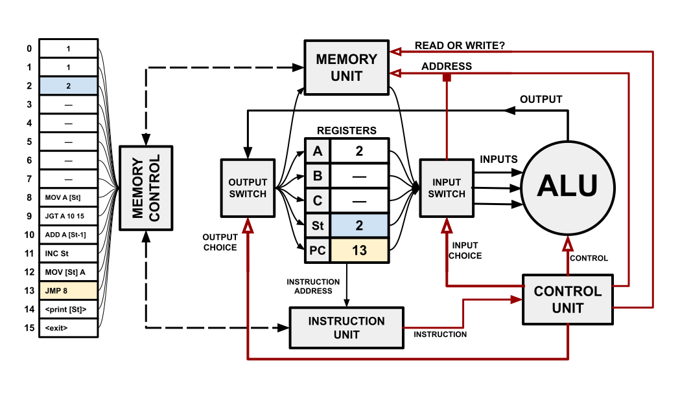

<!--slider web-->
# Computers in a Nutshell

We all know that computers operate through electronic circuits, but it can be difficult to connect that fact to our mental model of computers.

To help our understanding, let's construct an idealized computer piece by piece.

## The ALU

To begin, let's introduce the ALU (Arithmetic Logic Unit), sitting conspicuously on the right side of our figure.
An ALU is a collection of circuits that perform different arithmetic and logical operations.
Wires leading to and from the ALU carry signals encoding the inputs and outputs of these circuits.

<!--slider both-->

<!--slider split-->
<!--slider web-->
All the ALU's math/logic circuits use the same set of input/output wires, so only one operation can be performed at a given time.
To control which operation the ALU performs, let's add additional inputs that control what the current operation is.
<!--slider both-->

<!--slider web -->
We are now faced by these mysteries:
- Where do the input signals come from?
- Where do the output signals go to?
- Where do the control signals come from?

To answer these questions, we need to talk about registers.

<!--slider both-->

<!--slider split-->
<!--slider web-->
## Registers

Registers represent the fastest way to store and retrieve values in a processor.
Registers are used by a CPU to supply inputs to and store the outputs of computations.

While registers are fast, they are usually the most expensive way to store and retrieve values, so only a limited number of registers can be practically used in a CPU.

For now, let's give our CPU three registers, called A, B, and C.

<!--slider both-->

<!--slider split-->
<!--slider web-->
Let's also add a switch to supply register values to the ALU inputs.
<!--slider both-->

<!--slider split-->
<!--slider web-->
This switch is capable of routing register values to many different combinations of inputs.
Like the ALU, what the input switch should do depends upon context, so we will add additional inputs that control how values are routed.

Using a similar strategy, we can also select which registers are written by the ALU's output.
<!--slider slide-->

<!--slider split-->
<!--slider both-->

<!--slider split-->
<!--slider web-->
Assuming the red inputs are already solved, we could perform a variety of computations with this system, but we only have three registers of memory.

Modern programs require significantly more memory than a CPU could store in its registers.
To accommodate these memory requirements, computers need RAM.

## Random Access Memory

To greatly oversimplify a complex technology : Random access memory is a hardware implementation of an array.
The elements of this array are bytes, and each byte has its own index called an **address**.

The indexing of RAM is carried out by a memory controller, which listens for and performs read and write operations.
In order to use RAM, a processor must communicate with the memory controller to request these operations.

For our processor, this job will be dedicated to a "memory unit". {{footnote: Again: greatly oversimplifying a complex technology.}}
To the input and output switch, the memory unit will act just like a register, but the unit will actually be loading and storing the values to RAM. 

<!--slider both-->

<!--slider split-->
<!--slider web-->
The values read and written to RAM and the address where access occurs depends upon context.
Like the ALU, input switch, and output switch, we will add additional inputs to control the accessed address and the operation being performed.

<!--slider both-->

<!--slider split-->
<!--slider web-->

## Control

By this point, our computer has accumulated many mysterious red wires.

Of course, we can't just add mysterious wires forever.
Eventually, we need to figure out how each of these components know what they are supposed to do.

Let's take all of these red wires and connect them to something called a "control unit".
The control unit will be in charge of telling the other parts of the CPU what they should do.

<!--slider both-->

<!--slider split-->
<!--slider web-->

There may be times where the computer wants to use a register value as an address, but the control unit doesn't have direct access to the registers.
To fix this, let's add an additional channel leading from the input switch to the memory unit's address control input.

<!--slider both-->

<!--slider split-->
<!--slider web-->

With this setup, the control unit can use a register as an address by telling the input switch to direct the appropriate register value to the memory unit.

This still leaves us with another problem:
How does the control unit know what signals to send?

## Instructions

To simplify the design of this computer, let us make an assumption:
For every possible action which our CPU can perform, there is a number called an **instruction** which uniquely identifies that action.
Furthermore, the way instruction values are assigned to actions makes it easy for circuits to translate an instruction into its corresponding control signals.

If we can guarantee these assumptions, the control unit could receive an instruction as input, translate that instruction into its corresponding control signals, then send it to the other components of the processor.

<!--slider both-->

<!--slider split-->
<!--slider web-->

This still leaves us with one mysterious red wire, and one more question to answer:
Where do the instructions given to the control unit come from?

## Program Counter

Modern software is *BIG*, far larger than the registers available to modern processors.
In order to reference a program's instructions, they will need to be stored in RAM.

To keep track of where in RAM the current instruction is, let's add a register called the "program counter" (PC) and an "instruction unit".
The instruction unit reads from RAM at the address stored by the program counter, then communicates that instruction to the control unit.

<!--slider both-->

<!--slider split-->
<!--slider web-->

## Flow Control

Currently, there is no way for the PC to change, and so the ALU would just execute the same operation every time.
To fix this, we can incorporate the PC as an input and output to the ALU.

<!--slider both-->

<!--slider split-->
<!--slider web-->

With this alteration, the PC can update each time the ALU performs an operation.
Since we want the processor to perform *sequences* of instructions, let's establish that the PC is incremented after each instruction is executed.
For flow control structures like if/else statements and loops, special **jump** instructions can overwrite or offset the PC if a certain condition is true during execution.

## Stack Pointer

Our computer is now capable of executing code, but we'll be adding one more register to help its operation and to bring it closer to a realistic processor design.

<!--slider both-->

<!--slider split-->
<!--slider web-->

A stack pointer is a common type of register which is used to track the local variables used by functions.

When a function is called, the stack pointer is incremented by the amount of memory required to store the function's local variables.
While a function is executing, it local variables are stored in the memory which the stack pointer was incremented across.
Once a function has ceased execution, the stack pointer is moved back to its previous position.

This scheme is useful because it allows programs to cheaply allocate and deallocate memory for variables.

# The Instruction Cycle

Processors generally operate by cycling through three actions: fetching the next isntru

- fetching the next instruction
- decoding the instruction into control signals
- executing based off of those control signals

To demonstrate this cycle, our computer has been initialized to run a program.
This program should calculate the Fibonacci sequence, adding each value to stack storage until it encounters the first Fibonacci value greater than ten.

<!--slider both-->

<!--slider split-->
<!--slider web-->
## Fetch

The PC has a value of 8.
This means that the processor will fetch the instruction at address 8 in memory (`MOV A [St]`) and give it to the control unit.
<!--slider both-->

<!--slider split-->
<!--slider web-->
## Decode

The current instruction is `MOV A [St]`, which means "Move the value at `St` to register `A`".
Once the control unit decodes this instruction, it sends the relevant control signals to the rest of the processor:

- input switch: Use memory as input
- output switch: Use `A` as output
- memory unit: Read from `St`
- ALU: Simply return the input as output 

<!--slider both-->

<!--slider split-->
<!--slider web-->
## Execute

Once the control signals reach their destinations:
- the memory unit reads the value at address `St`, sending it to the input switch
- the input switch redirects the value from the memory unit to the ALU
- the ALU redirects the input as output, completely unchanged
- the output switch redirects the value to register `A`

<!--slider both-->

<!--slider split-->
<!--slider web-->
## Repeat

With the current instruction completed, the program counter is updated, preparing the processor for the next cycle.

<!--slider both-->

<!--slider split-->
<!--slider web-->
# Finishing the Program

To round out this explanation, let's run this program to completion.

This instruction, `JGT A 10 15`, means "If `A` is greater than 10, jump to address 15".

Register `A` is not greater than 10, so the PC will simply be incremented.

<!--slider both-->

<!--slider split-->
<!--slider web-->
## PC = 10

`ADD A [St-1]` means "Add the value at address `St-1` to register `A`".

The value 1 is added to the current value of register `A`, updating its value to 2.

<!--slider both-->

<!--slider split-->
<!--slider web-->
## PC = 11

`INC St` means "Increment `St` by 1".

The stack pointer is now pointing at address 2.

<!--slider both-->

<!--slider split-->
<!--slider web-->
## PC = 12

`MOV [St] A` means "Move the value at `A` to address `St`".

The value 2 from register `A` is written to RAM address 2.

<!--slider both-->

<!--slider split-->
<!--slider web-->
## PC = 13

`JMP 8` means "Set the PC to 8".

The next instruction is now the one at address 8.

<!--slider both-->

<!--slider split-->
<!--slider web-->
# Exercise: Completing the Program

We have just traced through one iteration of the loop used by this program.

How many more times will we execute the instruction at address 8?

What would the state of the computer be at those times?

Make your predictions, and check below.

<!--slider both-->

<!--slider split-->

<!--slider split-->

<!--slider split-->

<!--slider split-->

<!--slider split-->

