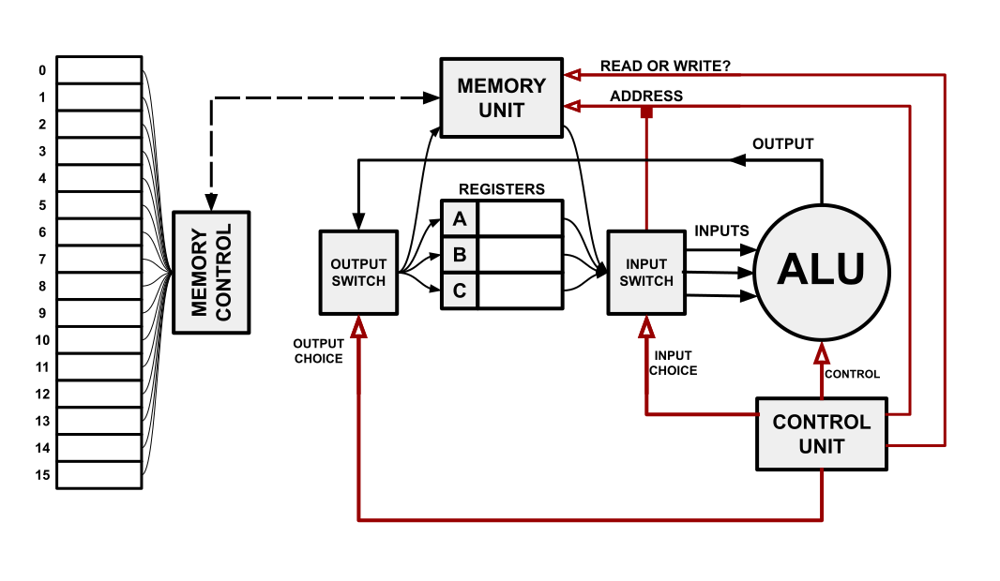
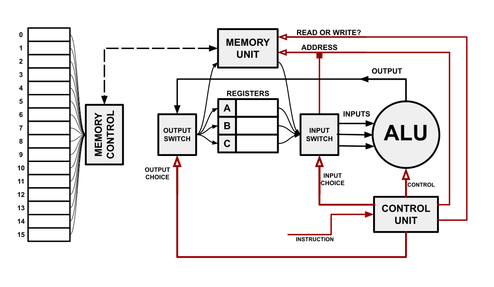
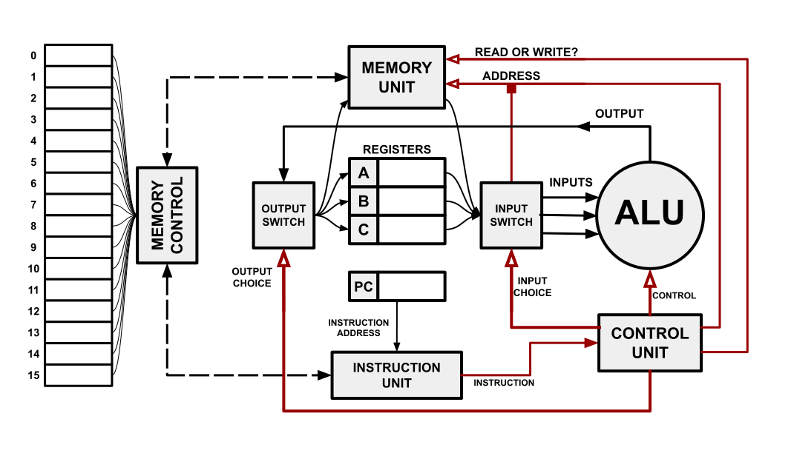
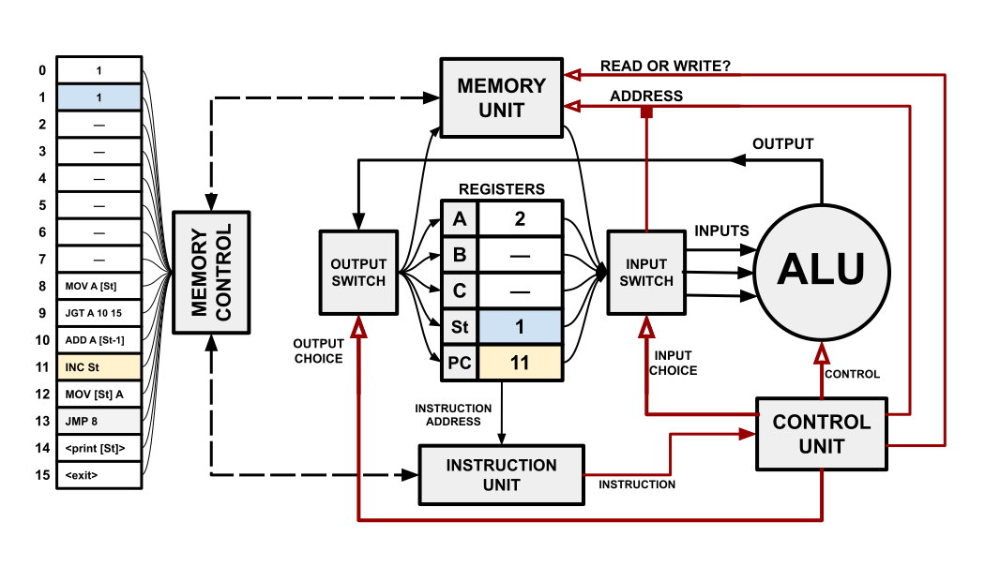

# Computers in a Nutshell

-

<!--slider split-->
<!--slider slide-->
# The ALU
<!--slider web-->
## The ALU
<!--slider both-->

- Let's start with the ALU
<!--slider cell-split 3 -->

<!--slider split-->
<!--slider slide-->
# The ALU
<!--slider both-->
<!--slider cell-split 3-->

<!--slider split-->
<!--slider slide-->
# Registers
<!--slider web-->
## Registers
<!--slider both-->
<!--slider cell-split 3-->

<!--slider split-->
<!--slider slide-->
# Routing Inputs
<!--slider both-->
<!--slider cell-split 3-->

<!--slider split-->
<!--slider slide-->
# Routing Outputs
<!--slider both-->
<!--slider cell-split 3-->

<!--slider split-->
<!--slider slide-->
# Routing Outputs
<!--slider both-->
<!--slider cell-split 3-->

<!--slider split-->
<!--slider slide-->
# Memory
<!--slider web-->
## Memory
<!--slider both-->
<!--slider cell-split 3-->

<!--slider split-->
<!--slider slide-->
# Memory
<!--slider both-->
<!--slider cell-split 3-->

<!--slider split-->
<!--slider slide-->
# Control
<!--slider web-->
## Control
<!--slider both-->
<!--slider cell-split 3-->

<!--slider split-->
<!--slider slide-->
# Instructions
<!--slider web-->
## Instructions
<!--slider both-->
<!--slider cell-split 3-->

<!--slider split-->
<!--slider slide-->
# Program Counter
<!--slider web-->
## Program Counter
<!--slider both-->
<!--slider cell-split 3-->

<!--slider split-->
<!--slider slide-->
# Flow Control 
<!--slider web-->
## Flow Control
<!--slider both-->
<!--slider cell-split 3-->

<!--slider split-->
<!--slider slide-->
# Stack Pointer
<!--slider web-->
## Stack Pointer
<!--slider both-->
<!--slider cell-split 3-->

<!--slider split-->
<!--slider slide-->
# The Instruction Cycle
<!--slider web-->
## The Instruction Cycle
<!--slider both-->
<!--slider cell-split 3-->

<!--slider split-->
<!--slider slide-->
# Fetch
<!--slider web-->
### Fetch
<!--slider both-->
<!--slider cell-split 3-->

<!--slider split-->
<!--slider slide-->
# Decode
<!--slider web-->
### Decode
<!--slider both-->
<!--slider cell-split 3-->

<!--slider split-->
<!--slider slide-->
# Execute
<!--slider web-->
### Execute
<!--slider both-->
<!--slider cell-split 3-->

<!--slider split-->
<!--slider slide-->
# Repeat
<!--slider web-->
### Repeat
<!--slider both-->
<!--slider cell-split 3-->

<!--slider split-->
<!--slider slide-->
# Finishing the Program
<!--slider web-->
## Finishing the Program
<!--slider both-->
<!--slider cell-split 3-->

<!--slider split-->
<!--slider slide-->
# PC = 10
<!--slider web-->
## PC = 10
<!--slider both-->
<!--slider cell-split 3-->

<!--slider split-->
<!--slider slide-->
# PC = 11
<!--slider web-->
## PC = 11
<!--slider both-->
<!--slider cell-split 3-->

<!--slider split-->
<!--slider slide-->
# PC = 12
<!--slider web-->
## PC = 12
<!--slider both-->
<!--slider cell-split 3-->

<!--slider split-->
<!--slider slide-->
# PC = 13
<!--slider web-->
## PC = 13
<!--slider both-->
<!--slider cell-split 3-->

<!--slider split-->
<!--slider slide-->
# Loop 1
<!--slider web-->
## Loop 1
<!--slider both-->
<!--slider cell-split 3-->

<!--slider split-->
<!--slider slide-->
# Loop 2
<!--slider web-->
## Loop 2
<!--slider both-->
<!--slider cell-split 3-->

<!--slider split-->
<!--slider slide-->
# Loop 3
<!--slider web-->
## Loop 3
<!--slider both-->
<!--slider cell-split 3-->

<!--slider split-->
<!--slider slide-->
# Loop 4
<!--slider web-->
## Loop 4
<!--slider both-->
<!--slider cell-split 3-->

<!--slider split-->
<!--slider slide-->
# Loop 5
<!--slider web-->
## Loop 5
<!--slider both-->
<!--slider cell-split 3-->

<!--slider split-->
<!--slider slide-->
# Completion
<!--slider web-->
## Completion
<!--slider both-->
<!--slider cell-split 3-->

