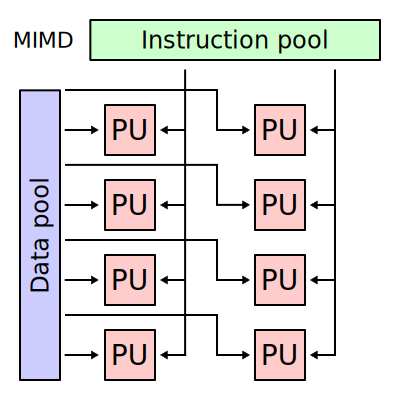

<!--slider web-->
# Models of Parallelism
<!--slider both-->

## Models of Interaction

<!--slider web-->
In order for a system to be meaningfully parallel/concurrent, the processes that make up that system need to communicate with each other.
The nature of this communication shapes the assumptions we can guarantee and the limitations we must respect.

Different software/hardware systems provide different limitations and guarantees in process interaction, so the strengths and weaknesses of these systems cannot be usefully represented by a single model.
Instead, computer scientists have developed a set of interaction models, each meant to reflect different types of software/hardware systems.
Through these models, we can frame our understanding of parallel/concurrent software around the abstraction that best fits its context.
<!--slider slide-->

- to be meaningfully parallel/concurrent, processes must communicate

- different communication abstractions have different strengths and weaknesses

- its useful to use the most relevant model when thinking about parallel/concurrent software

<!--slider both-->

<!--slider split-->

<!--slider row-split 2-->

### Shared Memory

Under the **shared memory** model of process interaction, processes share a global address space which they can read and write asynchronously.
This model is conventionally used to discuss processes with multithreading, since threads are effectively processes that share the same set of resources, including memory. {{footnote: As mentioned in a previous footnote, this is exactly how *NIX systems implement threads, but the distinction is more binary on other operating systems.}}

<!--slider web-->
The shared memory model does not have any restrictions over where and when processes write to memory, or what is written.
In this way, the shared memory model is the *fast and dangerous* model, offering the fewest limitations and the fewest guarantees.
Through clever mechanisms such as locks and atomics, process can interact with very low overhead to accomplish complex inter-dependent tasks.
However, the reduced guarantees of the shared memory model mean that more effort is required to ensure that our software is correct.

If you have worked with C/C++ at all before, you almost certainly have been stung by obscure memory-related bugs.
You can probably imagine how adding concurrency to your software would magnify the difficulty of these issues.
<!--slider none-->
- closest to how multithreaded processes behave
- easier resource sharing
- can be faster, but is more dangerous
<!--slider both-->

<!--slider cell-split 5-->

<!--slider split-->

### Message Passing

<!--slider web-->
If the set of parallel interaction models made up a spectrum with shared memory on one end, **message passing** would sit at the other end.
In contrast to shared memory **message passing** offers stronger guarantees and stronger limitations.

Under the message passing model, processes are relatively isolated from each-other, communicating by explicitly sending objects to each other.
Once an object has been received by an intended recipient, the recipient decides what to do to "resolve" that object.
By restricting communication to the controlled exchange of objects, interactions between processes become more explicit, which makes bugs from unintentional interactions less likely and easier to detect.

Passing a message to another process is analogous to calling a function in that process.
However, since the message sender is only sending the "input" to that function call, the implementation of that function is ultimately up to the receiver.

A prototypical example of parallelism through message passing is the Message Passing Interface, which is used by many scientific institutions to run massively parallel software on supercomputers.
In this context, it is common for both the sender and the receiver of the message to be processes executing the same program.
Hence, developers can have fine-tuned control over when messages are sent and how they are reacted to.

In highly distributed systems, such as peer-to-peer file sharing, the sender and the receiver may be running different programs written to implement the same protocol.
Additionally, compared to on-site institutional computing, peer-to-peer systems generally have fewer guarantees.
Peers may disconnect at any moment, may be performing a protocol incorrectly, or may behave maliciously.
<!--slider none-->
- communication is handled by explicitly sending and receiving objects between processes
- commonly used in supercomputing and distributed computing, both which need to communicate over networks
- by being explicit, the potential for unintended interactions is reduced
<!--slider both-->

<!--slider split-->
<!--slider row-split 2-->

### Partitioned Global Access Space

The **partitioned global access space** (PGAS) model represents a compromise between the shared memory and message passing model.

<!--slider web-->
Under PGAS, all processes share a global address space, but that address space is partitioned into sections that are local to different processes.
Typically, the portions of the address space local to a process are stored on that process's hardware, with accesses to local partitions simply accessing memory and accesses to non-local partitions handled through message passing.
<!--slider both-->

This scheme allows developers to implement software as though all processes are running on the same computer, even if it isn't.

<!--slider cell-split 5-->

<!--slider split-->

## Flynn's Taxonomy

There are multiple ways to evaluate streams of instructions on a processor.
Up to this point, we have mainly discussed processors that track one instruction sequence at a time an which process one operation at a time, but this is not always the case.

**Flynn's taxonomy** is a way of classifying computer architectures based upon two questions:
- does a processor execute more than one instruction stream at a time?
- does a processor process more than one piece of data at a time?

<!--slider web-->
The answers to these two yes-or-no questions lead to four possible classes:
- SISD : Single instruction, single data
- SIMD : Single instruction, multiple data
- MISD : Multiple instruction, single data
- MIMD : Multiple instruction, multiple data

Tracking more instruction streams in a processor requires more complex/expensive instruction fetching and control mechanisms, but allows for more flexible parallelism.

Processing multiple pieces of data at a time generally requires more register storage and more complex input/output multiplexing logic, but allows for higher raw throughput.

<!--slider both-->

<!--slider row-split-->

<!--slider web-->

<!--slider both-->

<!--slider web-->

<!--slider both-->

<!--slider cell-split-->

<!--slider web-->

<!--slider both-->

<!--slider web-->

<!--slider both-->

<!--slider cell-split-->

<!--slider web-->

<!--slider both-->

<!--slider web-->

<!--slider both-->

<!--slider cell-split-->

<!--slider web-->

<!--slider both-->

<!--slider web-->

<!--slider both-->

