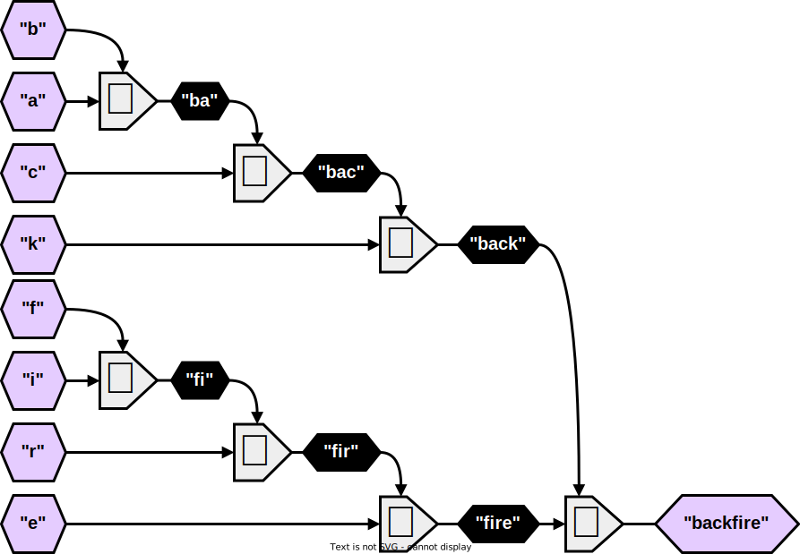
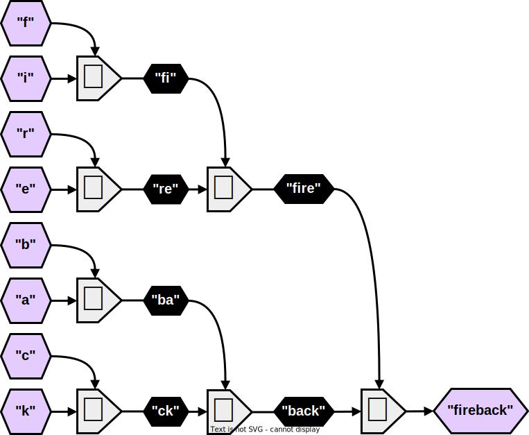
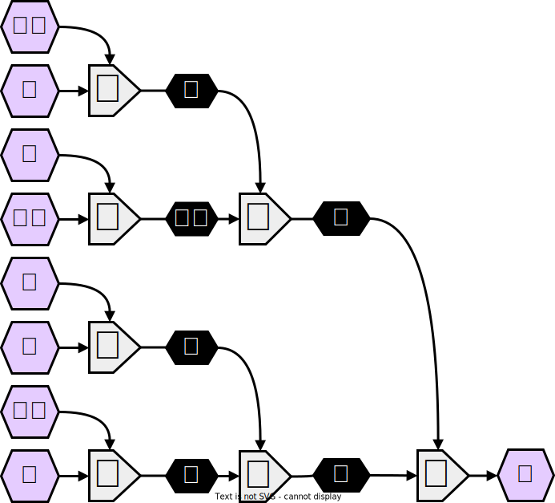
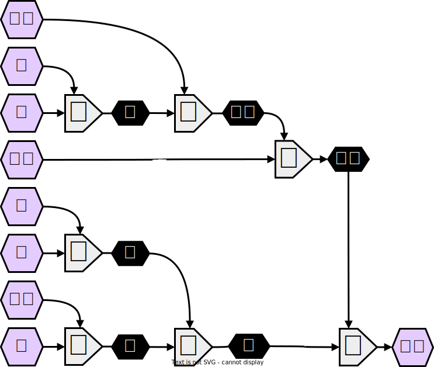
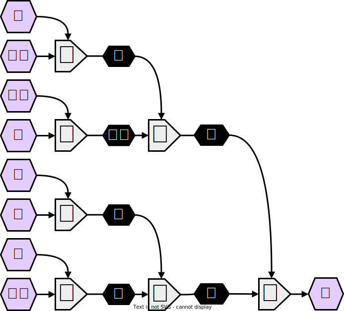
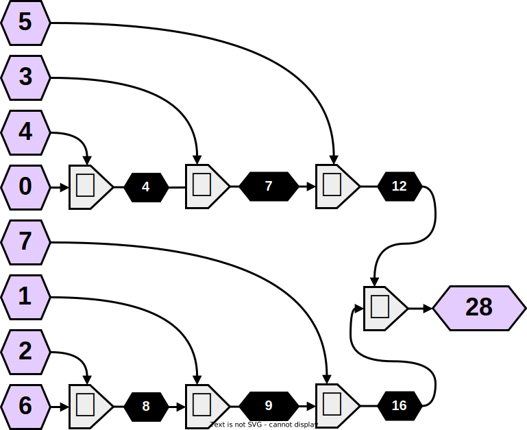

<!--slider split-->

<!--slider split-->

<!--slider split-->

<!--slider split-->

<!--slider split-->

<!--slider split-->

<!--slider split-->

<!--slider split-->

<!--slider split-->

<!--slider split-->

<!--slider split-->

