<!--slider web-->

# Organizing Execution

<!--slider both-->

## Programs

A program is a set of instructions.
For example, here is a C++ program.

```cpp
{{#include ./threads/program.cpp }}
```
Thrilling stuff, I know.

<!--slider split-->

## Executables

<!--slider row-split-->

An executable is a program that has been translated to machine code for direct execution by a processor. Executables are typically created by running a compiler on human-readable programs.

Here's a hex dump of our three-line C++ program's executable. As you can see, it isn't very easy to read:

<div style="height: 10em; overflow: scroll;">

```console
<!--cmdrun hexdump ./threads/prog -->
```

</div>

<!--slider cell-split-->

If you want to have a lower-level view of your program, most compilers have options to output the assembly corresponding to its binary output.
This is what gcc returned for our three-line program:

<div style="height: 10em; overflow: scroll;">

```x86asm
{{#include ./threads/program.s}}
```

</div>


For inspecting program assemblies, I highly recommend [godbolt.org](https://godbolt.org/).
It has a variety of options, and the defaults remove the parts you don't usually care about.

<!--slider split-->

## Processes

<!--slider web-->
In order to execute a program, its instructions need to be stored in memory and a processor must be directed to execute those instructions.
Additionally, depending upon the program, additional resources such as files, network IO, and access to peripherals may be required.
Furthermore, certain actions may or may not be allowed, depending upon which account asked to execute the program.

A process is a specific instance of a program's execution and its associated system resources and privileges.
By assigning resources and privileges to processes, operating systems can more easily manage the use of those resources and can more easily detect privilege violations.

During creation, the executable's instructions are copied into memory and the program setup specified by the executable is performed.

<!--slider slide-->
- Before a program is run, it needs to be given resources and privileges
- A **process** is an instance of a program's execution and its set of assigned resources and privileges
- Starting resources initialized based on executable and OS
- Privileges initialized based upon account and file metadata

<!--slider both-->
<!--slider cell-split-->

<div style="width: 80%; margin: auto;">

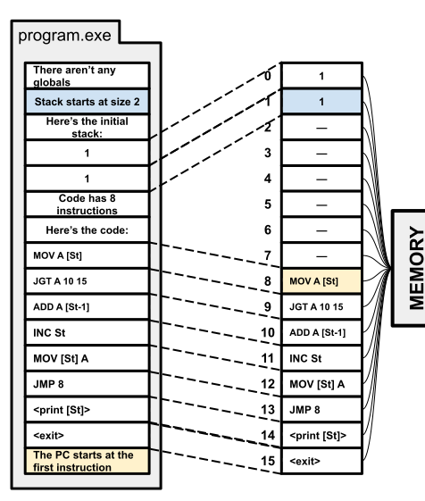
<!--slider web-->
*A loose approximation of how a program is loaded into memory. This program is from our [Computers in a Nutshell](./computers.md) chapter.*
<!--slider both-->

</div>

<!--slider split-->

## Multiprogramming

Multiprogramming is the practice of running multiple processes concurrently on the same computer.
This practice is also known as multitasking or time-sharing.

Multiprogramming is accomplished by keeping the state of each process (instructions, stack, heap, etc) in memory at the same time and switching execution between them.

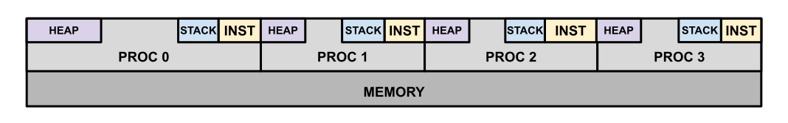

<!--slider split-->

Of course, the state of a process's execution is not defined only by what it stores in memory.
As a sequence of instructions is executed, the intermediate results of calculations, the location of temporary values, and the location of the instruction being executed are tracked through registers.
In order to fully restore a program after pausing its execution, the state of these registers must also be preserved.

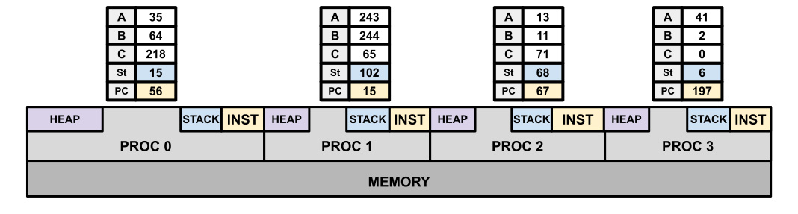


<!--slider split-->

Whenever a process switches out of execution the executing processor jumps to the process-switching instructions provided by the operating system.


These instructions:
- store the processors current state into memory reserved by the operating system
- reads the state information of a different process
- updates registers according to the retrieved processor state
- begins execution of the other process

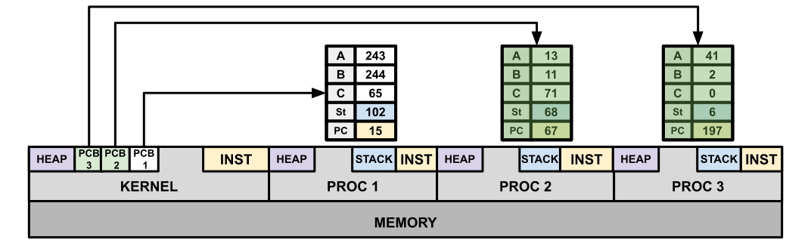
*The data structures used to track processes are called Process Control Blocks on \*NIX systems.*

<!--slider split-->

<!--slider web-->

## Threads

Because a process is partially defined by its resources, each new process that is created represents resources that are denied to other processes.

Interestingly, the information that is required to execute within a process's resources is relatively small and so is cheap to store. Because of this, OS designers eventually decided to represent execution state as a separate abstraction called a **thread**. {{footnote: The difference between a process and a thread is more complicated than this on *NIX systems. This is because they allow independent processes to share resources and implement threads as processes that share all their resources. Additionally, *NIX systems generally allow for a wide variety of resource combinations to be shared or exclusive, which turns the process/thread binary into more of a spectrum. For the purposes of this class, we will be treating the division between thead and process as binary.}}

With this abstraction, each process is associated with one or more threads, and each thread represents an independent sequence of execution within its parent process.
This many-to-one relationship allows the same resources to be shared across multiple concurrent tasks, increasing the resource efficiency of the system.

<!--slider slide-->
Because a process is partially defined by its resources, each new process that is created represents resources that are denied to other processes.

OS designers noticed this and separated the execution of instruction sequences into a different abstraction called a **thread**.

Through this abstraction, multiple execution states can be tracked per process, allowing concurrent tasks to be performed more efficiently by sharing resources.

<!--slider both-->

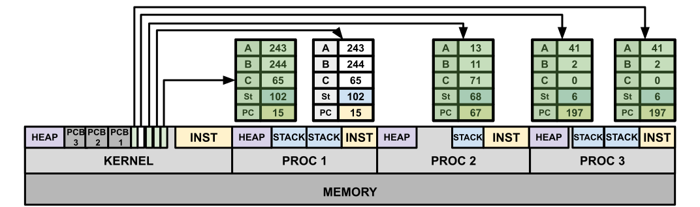

This practice is referred to as **multithreading**, and is a common method for improving the performance and flexibility of programs.

<!--slider split-->


## Working with (C++) Threads

There are many APIs that provide threading capabilities.
To keep development simple, example code will use the the [C++ \<thread\> library](https://en.cppreference.com/w/cpp/thread).

### Common Thread API Features

Most Thread APIs have the following features:
- Thread handles   : Objects that identify/represent specific threads.
- Thread creation  : Starting a new thread and receiving a handle for it.
- Thread joining   : Waiting in one thread for a thread to complete.
- Thread detaching : Notifying the OS/API that no other threads will wait for a specific thread to complete (so it can clean up after itself)

<!--slider split-->
<!--slider slide-->

## Working with (C++) Threads

<!--slider row-split-->

### Common Thread API Features

Most Thread APIs have the following features:
- Thread handles   : Objects that identify/represent specific threads.
- Thread creation  : Starting a new thread and receiving a handle for it.
- Thread joining   : Waiting in one thread for a thread to complete.
- Thread detaching : Notifying the OS/API that no other threads will wait for a specific thread to complete (so it can clean up after itself)

<!--slider cell-split-->

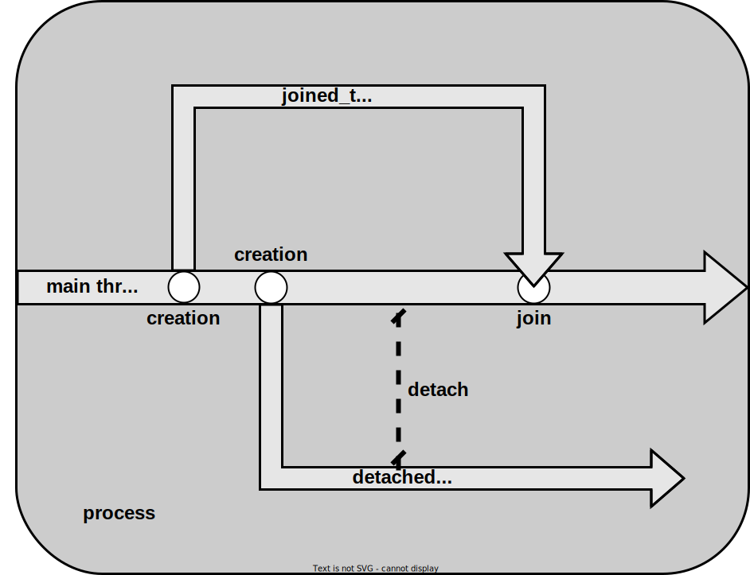

<!--slider split-->

## Working with (C++) Threads

<!--slider web-->

Here is a simple program using the \<thread\> API, as well as a diagram showing its operations across the lifetimes of its threads.

```cpp
{{#include ./threads/threads_simple.cpp}}
```
<div style="width: 60%; margin: auto;">


</div>

<!--slider slide-->

<!--slider row-split-->

Here's a short example program:

<div style="font-size: 0.75em; height: 60vh; overflow: scroll;">

```cpp
{{#include ./threads/threads_simple.cpp}}
```

</div>

<!--slider cell-split-->


<!--slider split-->

## Working with (C++) Threads

<!--slider row-split-->


<div style="font-size: 0.75em; height: 60vh; overflow: scroll;">

```cpp
{{#include ./threads/threads_simple.cpp}}
```

</div>

<!--slider cell-split-->

<!--slider both-->
The program's output:

```console
<!--cmdrun ./threads/simple -->
```


<!--slider web-->

### A More Involved Example

Here's a program with a bit more application involved:
```cpp
{{#include ./threads/chiron.cpp}}
```

If you run this program, it will display a simple text animation.
The text used is the first argument of the program or, if no argument is provided, `"Your message here"`.

This program is evaluated through two threads.
The main thread spawns a watcher thread that will set a boolean to `true` and terminate once the user has hit enter.
As the watcher thread waits, the main thread loops through different element rotations of a message, printing them 0.1 seconds apart.

### Thread Teams

Also, since threads are represented as objects in the C++ thread api, teams of threads can be organized via arrays/collections of thread objects.

For example, this program creates a team of threads that prints their thread IDs until the user presses enter:

```cpp
{{#include ./threads/thread_team.cpp}}
```


<!--slider both-->

<!--slider split-->


## Thinking about Threads
<!--slider row-split-->

When thinking about threads, it is important to understand the system of thread creations (aka "forks"), detaches, and joins applied by the program.
The structure of forks/joins/detaches subdivides the execution of a program into the set of independent sequential tasks that the processor will follow.

To begin, let us consider a single process that uses multiple threads.


<div style="width: 80%; margin: auto;">

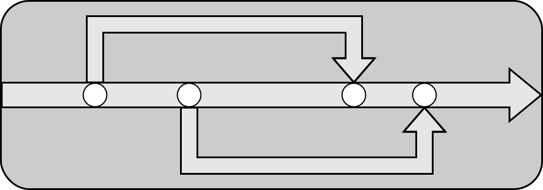
</div>

<!--slider split-->
<!--slider slide-->
## Thinking about Threads
<!--slider both-->

If this process is running on a one-processor machine, then the processor would "unroll" the concurrent components of the program into one sequence of execution.

When thinking about this "unrolling", remember that the processor cannot execute a segment of a thread's "path" if any previous segment has not yet been executed.

<div style="width: 80%; margin: auto;">

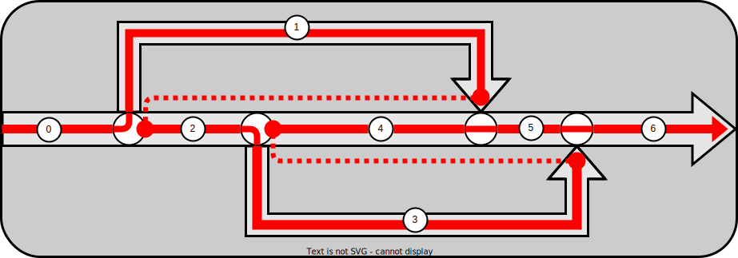
</div>

<!--slider split-->

### Variations in Order of Execution

There are multiple possible orders to execute concurrent threads.
For example, there here are two possible execution orderings for the same program.

If two possible orderings for a program produce different results, that program has a **race condition**.

<!--slider cell-split 2-->

<!--slider web-->
<div style="width: 80%; margin: auto;">
<!--slider both-->

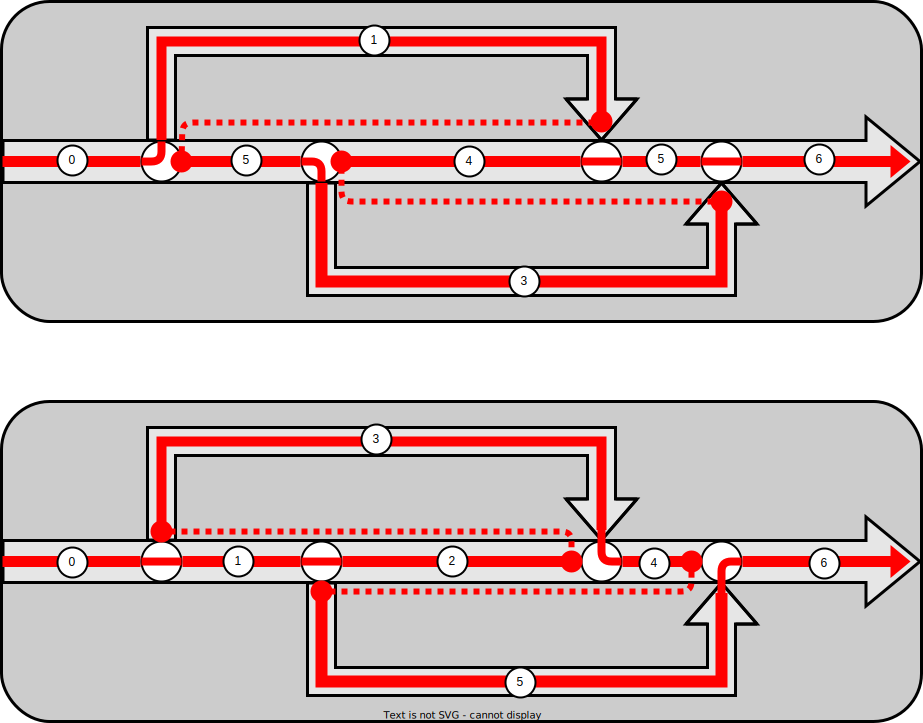
<!--slider web-->
</div>
<!--slider both-->


<!--slider split-->

### Uniprocessed Multiprogramming

Here is an example of a single-processor system executing two processes concurrently.

<!--slider cell-split 2-->

<!--slider web-->
<div style="width: 80%; margin: auto;">
<!--slider both-->

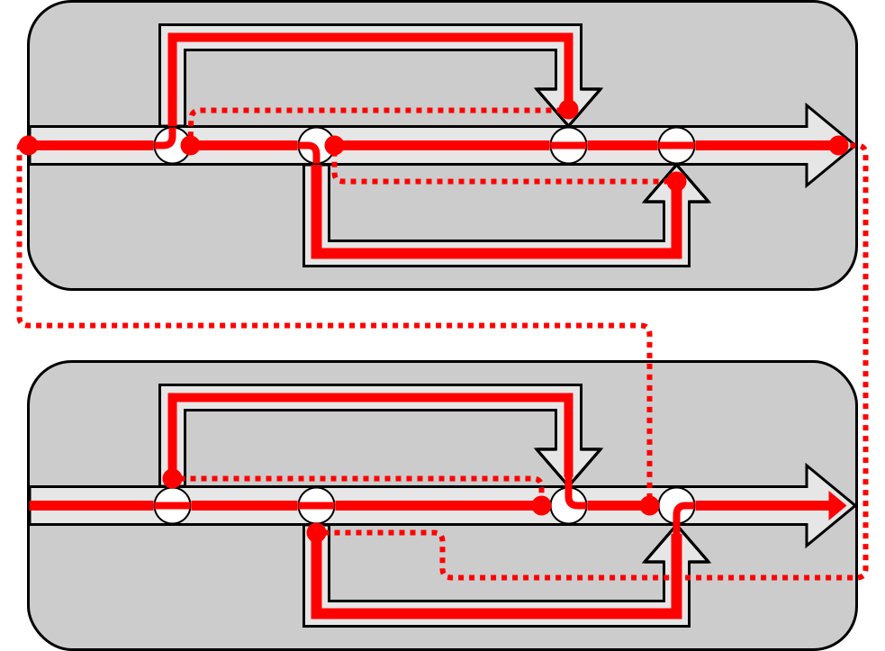
<!--slider web-->
</div>
<!--slider both-->


<!--slider split-->

### Multiprocessed Multiprogramming

If an additional processor was added to the system, the executions performed by both processors could interleave across multiple processes, as shown below.

<!--slider cell-split 2-->

<!--slider web-->
<div style="width: 80%; margin: auto;">
<!--slider both-->

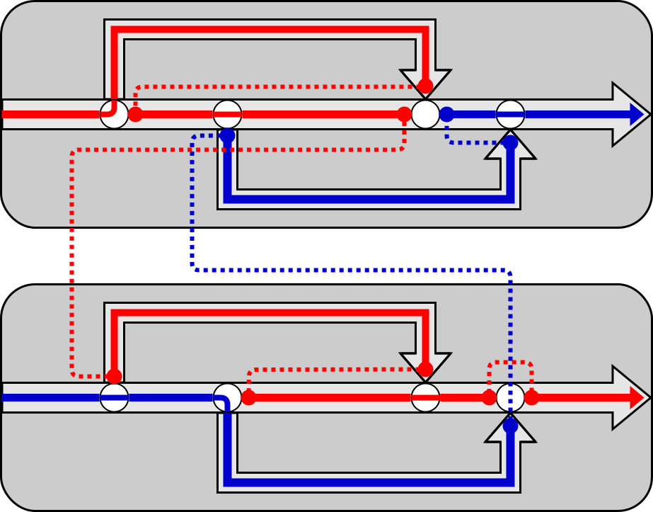
<!--slider web-->
</div>
<!--slider both-->


<!--slider split-->


### Multiprocessed Uniprogramming

If you were running this pair of processes on an OS that had multithreading without multiprogramming, both processors would interleave execution on each process in sequence.


<!--slider cell-split 2-->

<!--slider web-->
<div style="width: 80%; margin: auto;">
<!--slider both-->

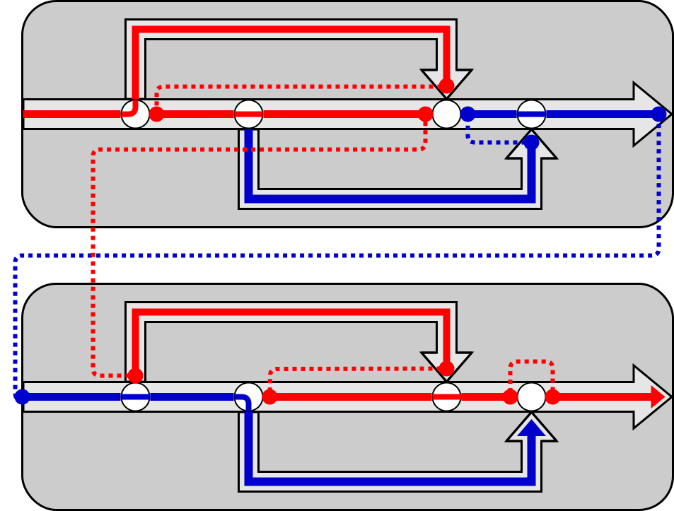
<!--slider web-->
</div>
<!--slider both-->


<!--slider split-->


### User Threads

**User threads** are threads that are implemented as part of a user program, as opposed to **kernel threads**, which are provided by the operating system.
To the operating system, user threads don't exist as "real" (kernel) threads.
Instead, the program that implements the user threads is simulating the behavior of multiple threads through the execution of a single kernel thread.

<!--slider web-->
While user threads don't provide additional processing power, they are less resource-intensive compared to kernel threads. They are useful when:
<!--slider slide-->

- kernel threads are not available
- implementing a virtual machine
- there are so many concurrent tasks, representing them all with kernel threads would introduce significant overhead

<!--slider cell-split 2-->

<!--slider web-->
<div style="width: 80%; margin: auto;">
<!--slider both-->


<!--slider web-->
</div>
<!--slider both-->


<!--slider split-->


### Hybrid (M-to-N) Threads

**Hybrid threads** are a compromise between user and kernel threads, where multiple kernel threads cooperate to simulate a greater number of threads.

<!--slider cell-split 2-->

<!--slider web-->
<div style="width: 80%; margin: auto;">
<!--slider both-->


<!--slider web-->
</div>
<!--slider both-->


<!--slider split-->


## Preemptive vs Cooperative Multitasking

Up to this point, we haven't discussed the mechanism that allows processors to switch between different threads.

<!--slider web-->
For our diagrams, we only had processors switch between threads at significant events such as thread creation and thread joining.
While this makes the diagrams easier to read, this sort of thread-switching pattern is not always present.

Most operating systems use **preemption** to switch between threads.
Preemption is the interruption of a thread's execution, where the program counter (PC) is set to jump the processor to a different set of instructions.
Conventionally, the PC is set to execute special code provided by the operating system to perform a particular task.
As part of this, the processor temporarily gains kernel-level privileges to access data structures that user-land programs cannot.
Once the switch back to user instructions is initiated, these kernel-level privileges are removed.

Most modern processors come with a special clock that can send an interrupt on a fixed time interval.
Operating systems use this clock to switch between threads by having it periodically force the processor to run special code that swaps the current thread out for a different one.
This whole thread-switching process is known as **context switching**.

<!--slider both-->

With pre-emptive multitasking, a processor can switch between threads at any point during execution, and the operating system doesn't need to rely upon user programs voluntarily giving up processor time.
While this is convenient, it requires kernel-level privileges to implement.
In cases where such privileges aren't available, such as user-threading, programs apply **cooperative multitasking**.

Cooperative multitasking is multitasking accomplished through tasks/threads explicitly giving up their spot on the processor for other threads.
In cases where all threads can be trusted to do so, this can be a useful way to structure highly concurrent tasks.
For example, many programming languages implement async function calls through cooperative, user/hybrid-threaded multitasking.


<!--slider split-->

## Summary
- Multiprogramming : Executing multiple processes concurrently
- Multiprocessing  : Executing across multiple processors at the same time
- Multithreading   : Executing multiple threads concurrently as part of the same process
- Kernel Threads   : The threads provided by an OS
- User Threads     : A single kernel thread "pretending" to be multiple threads
- Hybrid Threads   : Multiple kernel threads "pretending" to be even more threads

