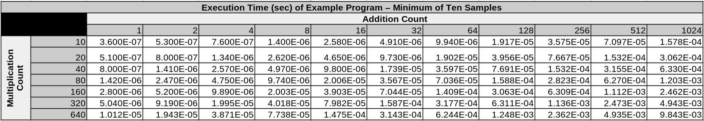
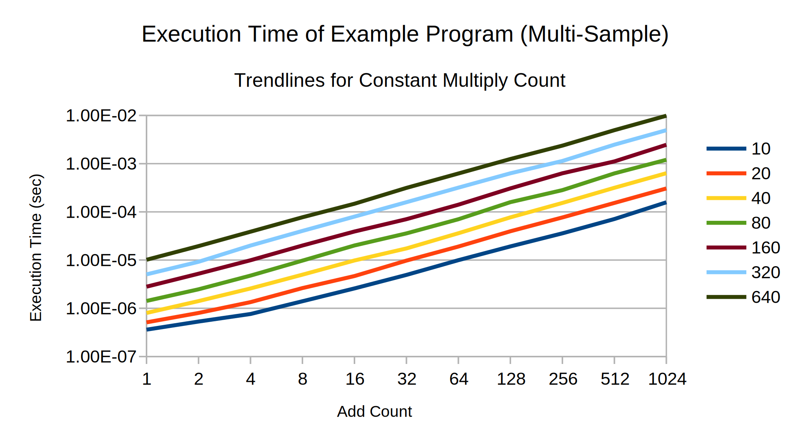

# Showing Data
<!--slider web-->

A major component of this course is investigating and presenting performance data.
A portion of your project grades will be evaluated based upon the quality of your data, your presentation of that data, and your analysis of that data.


<!--slider slide-->

This course is about Computer *Science*, and you will need to engage with course concepts from a scientific perspective

Part of science is communicating ideas:

- What information you gather

- What patterns you see

- What processes (calculations) you used to get further information 

Following these guidelines will help you communicate your ideas effectively, which will get you a better grade.

<!--slider cell-split-->

<div style="width: 50%; margin: auto;">


[Randall Monroe (xkcd), CC BY-SA 2.5](https://xkcd.com/2048)

</div>

<!--  -->

<!--slider split-->

<!--slider web-->
## Table Conventions

### Labeling and Units

Tables of data should:
- have a header
- label its rows and columns according the the value of the corresponding independent variable
- label its row and column axes to describe the variables depicted
- show units for data as well as row/column labels

As long as the table header clearly states the units for the data presented, individual cells do not need to be labeled with units.

### Significant Figures

Tables of data should provide a reasonable number of significant figures.

Too many significant figures can make them difficult to read and may imply precision that doesn't exist.
Too few significant figures makes interpretation more difficult.
As a general rule, having between 3 and 6 significant figures should be fine. With very low values, fewer than 3 significant figures is also reasonable.


```admonish example title="Example: A Well-Labelled Table with a Reasonable Number of Significant Figures"

```

<!--slider slide-->

# Table Conventions

<!--slider row-split-->

- have a header
- label its rows and columns according the the value of the corresponding independent variable
- label its row and column axes to describe the variables depicted

<!--slider cell-split-->

- show units for data as well as row/column labels
- significant figures respect accuracy and readability (3-6 sig figs are reasonable)
- scientific notation is recommended

<!--slider row-split-->

```admonish example title="Example: A Well-Labelled Table with a Reasonable Number of Significant Figures"

```


<!--slider split-->
<!--slider web-->

## Graphing Conventions 


### Labelling
Graphs should:
- have a title
- label axes and provide corresponding units
- label trend lines with their corresponding values
- provide units for trend lines either with a legend title or in the title/subtitle of the graph


### Visual Clarity
Graphs should:
- scale axes to aid interpretation, avoiding overlapping trend lines
- not use line smoothing on trendlines, as this implies extra data points that do not exist
- use good quality data with little noise. Taking the maximum of samples can help with this.


```admonish example title="Example: A Decent Graph"

```

<!--slider slide-->

# Graphing Conventions

<!--slider row-split-->

Labelling:
- have a title
- label axes and provide corresponding units
- label trend lines with their corresponding values
- provide units for trend lines either with a legend title or in the title/subtitle of the graph

Readability:
- scale axes to aid interpretation, avoiding overlapping trend lines
- don't use line smoothing on trend-lines. This implies extra data points that do not exist
- use good quality data with little noise. Taking the maximum of samples can help with this.


<!--slider cell-split-->

```admonish example title="Example: A Decent Graph"

```


<!--slider split-->
<!--slider web-->

## Showing Your Work 

When making claims about data, we often discuss the results of calculations.
While showing your work is not required for large collections of data, you are expected to at least show the equations/formulae you used to perform your calculations.
For small collections of data, you are expected to show the intermediate values you get from applying each formulae

<!--slider slide-->

# Showing Your Work 

<div style="height: 3em"></div>

- You are expected to show how you arrived at any figures you have calculated

- For large collections of data, you may summarize your work by showing the equations/formulae you used and describing how you used them

- For small collections of data, you are expected to show the intermediate values you get from applying each formulae

<!--slider cell-split-->

<div style="width: 50%; margin: auto;">


[Randall Monroe (xkcd), CC BY-SA 2.5](https://xkcd.com/2295)

</div>

<!--slider both-->
<!--slider split-->

## Interpreting your Data
<!--slider row-split-->

In addition to sound data and sound mathematics, your interpretation of data should make sense.
Interpretation is inherently abstract, and has grey areas, but as a general rule:

- The conclusions you make should be consistent with one-another
- If the data/patterns are strange or contradictory:
    - Check your code for bugs
    - Investigate your data gathering/interpretation techniques for mistakes
    - Consider possible sources of bias/error
    - If your data is still weird, acknowledge the weirdness in your data and provide your best explanation of that weirdness
- Your interpretations should connect to course concepts as best they can, and they should accurately convey course concepts
- Your interpretations should follow common sense

<!--slider slide-->
<!--slider cell-split-->


[Randall Monroe (xkcd), CC BY-SA 2.5](https://xkcd.com/605/)

<!--slider both-->

