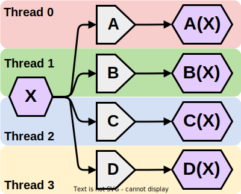
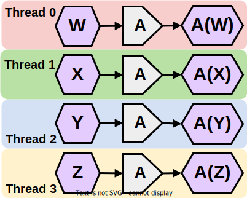
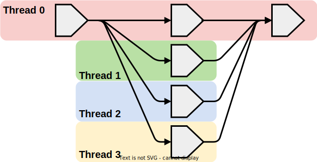
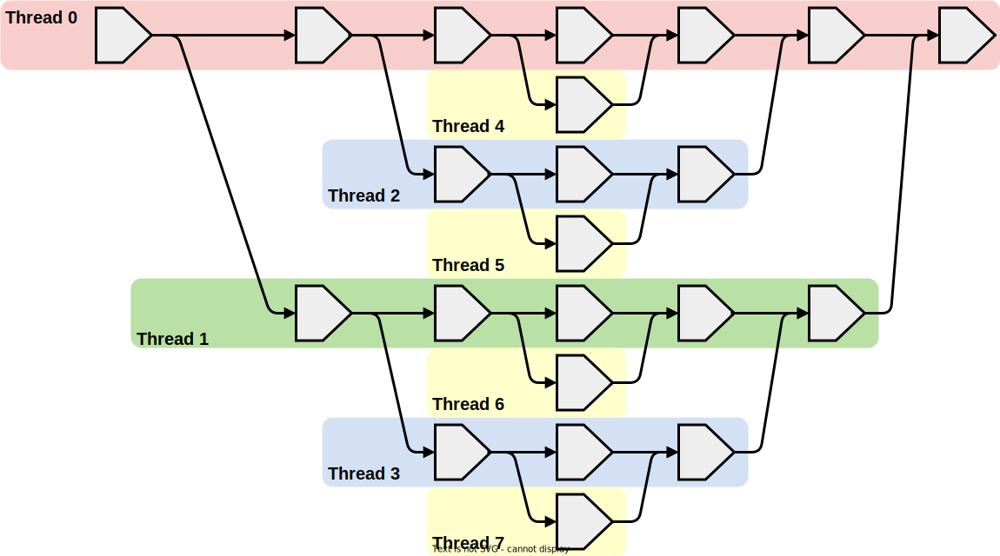
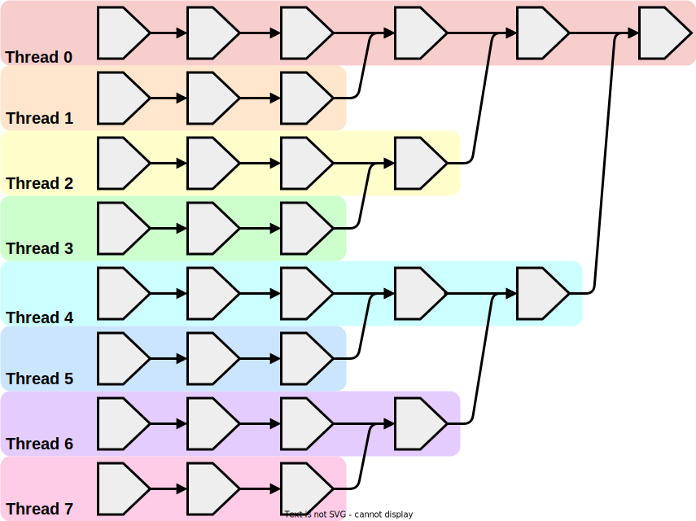

# Decomposing Problems

As discussed in [the previous chapter](./graphs.md):
- the parallelization of a computation requires the assignment of different operations across different threads
- the dependencies which extend between threads can require communication between threads, which adds overhead to execution

Given these facts, getting the best performance for a particular computation involves assigning operations across threads in a way that minimizes communication cost.
To tackle this problem, computer scientists have developed several operation/thread assignment strategies.

<!--slider split-->

<!--slider web-->
## Task Parallelism

If a computation is made up of a set of mostly-independent tasks, the operations of that computation can be effectively subdivided by the corresponding task. Generally speaking, in order to count as task parallelism, the tasks need to be different from each-other.

 

<!--slider slide-->

<!--slider web-->

<!--slider both-->

 

<!--slider split-->

<!--slider web-->
## Data Parallelism

If a computation requires processing many pieces of data, and very little communication is required between the operations that process different pieces of data, the operations of that computation can be effectively divided by their corresponding data.

 

<!--slider slide-->

<!--slider web-->

<!--slider both-->

 

<!--slider split-->

<!--slider web-->
## Task and Data Parallelism ?

If a computation has independence both between the different tasks it performs and between the different data it processes, both task and data parallelism can be applied simultaneously.
Realistically, most parallel processing patterns are both task and data parallel in some respect, but if one factor obviously dominates the decision of how to break up operations, it is common to simply describe it as that form of parallelism.

 

<!--slider slide-->

<!--slider web-->

<!--slider both-->

 

<!--slider split-->

<!--slider web-->
## Pipeline Parallelism

If a computation requires the execution of the same series of operations across multiple pieces of data, each operation in that series could be assigned to a different thread.
In order for this strategy to be effective, the mechanism used to synchronize execution between threads must be relatively cheap, especially relative to the amount of work required to perform each operation.

 

<!--slider slide-->

<!--slider web-->

<!--slider both-->

 

<!--slider split-->
<!--slider web-->

## Fork and Join

If a computation involves the execution of many independent operations between a common dependency and dependent, each of these independent operations could be subdivided across multiple threads.
For this strategy to make sense, the cost of creating, synchronizing, and terminating these threads should be lower than the cost of executing all the independent operations serially.

 

<!--slider slide-->

<!--slider web-->

<!--slider both-->

 

<!--slider split-->

<!--slider web-->

## Divide and Conquer

If a computation applies a divide-and-conquer approach, where problems are recursively subdivided into independent sub-problems, each of these independent sub-problems could be effectively executed across different threads.
Usually, a process should stop spawning additional threads after a certain recursion depth, since the number of threads used by the process will eventually surpass the number of processors available on the executing machine.
In particularly large problems, spawning a new thread with each level of recursion can cause a program to crash due to insufficient resources.

 

<!--slider slide-->

<!--slider web-->

<!--slider both-->

 

<!--slider split-->
<!--slider web-->

## Map and Reduce

If a computation is calculating a relatively small output based upon a relatively large set of data, the operations of that computation can be effectively subdivided by processing each piece of data in its own thread, then performing a reduction operation to "condense" that operation to the final output.
Generally speaking, this strategy is effective when the reduction operation applied is associative or commutative, since this loosens the ordering requirements between operations.

 

<!--slider slide-->

<!--slider web-->

<!--slider both-->

 

