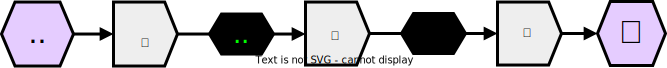
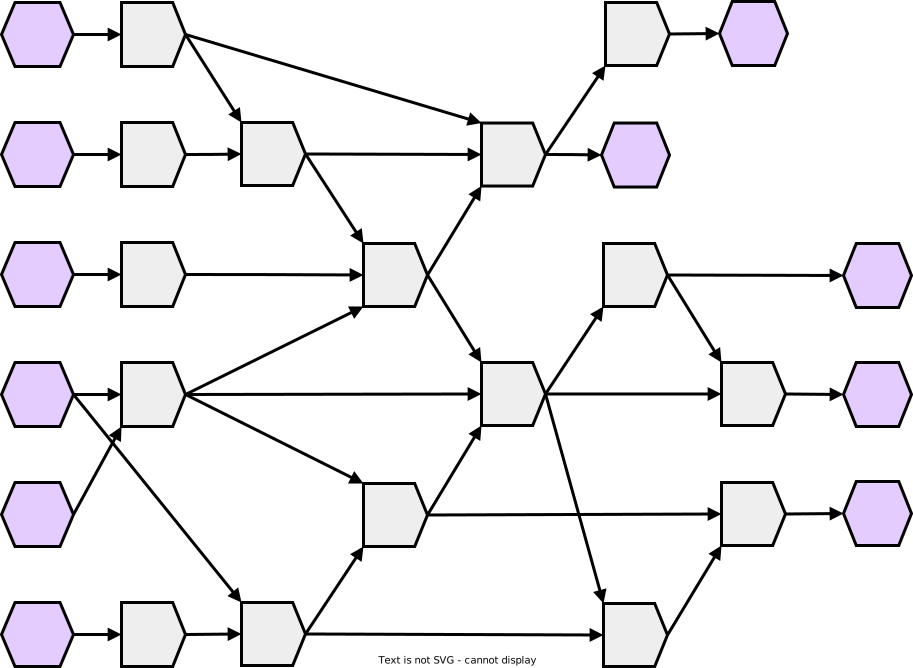
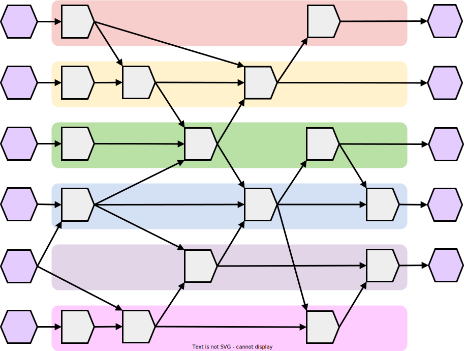

# Dependency Graphs

## Planting Seeds

Imagine that you are a farmer.

Your crop of choice is corn, and the process of generating one unit of corn is:

1. sow seeds in an empty patch of dirt, making it a sown patch of dirt
2. water the sown patch of dirt, making it grow into a corn stalk
3. harvest the corn stalk, yielding a unit of corn

 

 

<!--slider split-->

This process involves the operations:
- sow seeds
- water 
- harvest

These operations must be evaluated in the order (sow,water,harvest), because each watering relies upon the effects of sowing seeds and each harvesting relies upon the effect of a watering.
If we plan to grow only one unit of corn, then there would be only one possible order these operations could be evaluated.

 

 

<!--slider split-->

What if we wished to grow six units of corn?

 

<!--slider slide-->

<!--slider web-->

<!--slider both-->

 

<!--slider split-->

We could perform our one-corn solution for each unit of corn in our problem.
 

<!--slider slide-->

<!--slider web-->

<!--slider both-->

 
<!--slider split-->
We could also sow the seeds for all patches of soil, then water all of the seeds, then harvest all of the corn.
 

<!--slider slide-->

<!--slider web-->

<!--slider both-->

 
<!--slider split-->
We could also sow all of th seeds, then perform watering and harvesting for each sown soil patch in sequence.
 

<!--slider slide-->

<!--slider web-->

<!--slider both-->

 
<!--slider split-->
We could also perform this order of operations.
Initially, this ordering appears to defy the dependencies between sowing, watering, and harvesting.
However, this ordering still respects the order of execution between operations in the same chain of dependencies.
 

<!--slider slide-->

<!--slider web-->

<!--slider both-->

 
<!--slider split-->
What if you collaborated with other farmers?

More operations could be completed at the same time, and so the full set of tasks could be accomplished faster.
For example, assuming each operation took one "time unit" to complete, the orderings shown below would reduce the required time from 18 units to 9 units.
 

<!--slider slide-->

<!--slider web-->

<!--slider both-->

 
<!--slider split-->
With three farmers, the required time can be further reduced to 6 time units.
 

<!--slider slide-->

<!--slider web-->

<!--slider both-->

 
<!--slider split-->

Of course, with six farmers, the required time can be reduced to 3 time units, but what if we had **more** than six farmers?

 

<!--slider slide-->

<!--slider web-->

<!--slider both-->

 

 

<!--slider web-->

No matter how many farmers we add, a farmer counts above six will not speed up the process more than a farmer count of six can support.
The maximum number of farmers that can work at a given time on this problem is six.
Similarly, the minimum possible time this process can take is 3 time units, even with farmer counts above six.

## Dependency Graphs

If you think the task of these hypothetical farmers seems suspiciously similar to the execution of multi-processed programs discussed in the [Organizing Execution](../intro/threads.md), you would be correct.
However, unlike previously, the problem presented to these farmers has no explicit thread structure. For example, while the process of growing a unit of corn is thread-like, no single chain of dependencies in our set of six is designated as the "main thread".

This sort of problem representation is a **dependency graph**.
A dependency graph decomposes a process into a set of operations, each of which have zero or more dependencies.
As long as the dependencies of each operation are satisfied before that operation is executed, the overall process should be correctly executed as well.

As long as the inputs are known ahead of time, the execution of any algorithm can be represented in terms of a dependency graph.
Consequently, the implementation of an algorithm must respect the structure of dependencies that arise with each valid input.

These dependency structures are particularly relevant to parallel/concurrent software developers because they specify which sets of operations can be executed concurrently and which sets of operations must be executed in a certain order.
By thinking of an algorithm in terms of its dependency structures, software developers can more easily find opportunities to make its execution faster and can more easily detect **race conditions**. 

With enough practice, an experienced programmer can develop an intuitive understanding of how different algorithms map to different dependency structures, leading to faster and smoother development.
This intuition can look like magic to other developers, and can help you stand out in the work force.
Hopefully, by the end of this textbook, you will have developed the foundations of this intuition.

## Structure

<!--slider both-->
<!--slider split-->

Here is an example dependency graph:
 

<!--slider slide-->

<!--slider web-->

<!--slider both-->

 
<!--slider split-->
<!--slider web-->

For this course, we will use the following notation:
- Inputs and outputs will be represented by purple hexagons
- Operations will be represented by grey pentagons
- Dependencies will be represented by arrows

If a dependency includes the use of one operation's output as another operation's input, the intermediate value may be displayed as a black hexagon overlaid on the corresponding arrow, as shown in the farming diagrams.

Later in this book, additional notation conventions will be added.

### Establishing Bounds

In our corn-farming problem, we found there is a maximum number of farmers that could work simultaneously and that there was a minimum amount of time required to complete the desired harvest.

All dependency graphs come with similar limitations, since they share the same basic properties.
For example, all dependency graphs are directed acyclic graphs (DAGs), since dependencies have an implicit direction and an algorithm with a dependency cycle is inherently impossible to evaluate.
Because dependency graphs ard DAGs, they can be [topological sorted](https://en.wikipedia.org/wiki/Topological_sorting) to establish a valid linear order of execution.
Once topologically sorted, operations that are adjacent in the ordering and which don't depend upon each other can be executed at the same time.

By packing independent operations into the same time, we can find the minimum amount of time required by a process.

 

<!--slider slide-->

<!--slider web-->

<!--slider both-->

<!--slider web-->
 
This minimum time is determined by the chain of operations that forms the longest sequence in the graph.
Such a sequence is called a **critical path** of the computation.
The length of a graph's critical path is known as the computation's **depth** or **span**.
As shown here, our example graph has **three** critical paths:
 
<!--slider both-->

<!--slider split-->

<!--slider slide-->

<!--slider web-->

<!--slider both-->

<!--slider web-->
 

If a dependency graph has also been packed to optimize the maximum temporal overlap of operations, one can also determine the maximum number of processors that meaningfully speed up a problem.
The maximum number of simultaneously-executable operations in our example graph is five:

 
<!--slider both-->

<!--slider split-->

<!--slider slide-->

<!--slider web-->

<!--slider both-->

 

<!--slider web-->

### Assigning Threads and Synchronization Basics

When planning the parallelization of a computation, assigning portions of the computation to different threads is analogous to dividing the dependency graph into different segments:

 
<!--slider both-->
<!--slider split-->

<!--slider slide-->

<!--slider web-->

<!--slider both-->

<!--slider web-->
 

Even if operations contained within the same thread are guaranteed to be executed in the correct order relative to each-other, the dependencies that connect operations in different threads require additional infrastructure.
Without any communication between threads, there is no way for one thread to know whether a dependency from another operation has been resolved yet.

 
<!--slider both-->
<!--slider split-->

<!--slider slide-->

<!--slider web-->

<!--slider both-->

<!--slider web-->
 

To guarantee the ordering of operations between threads, software developers apply **synchronization**.
There are various synchronization methods, but for now let's focus upon **barriers**.

A barrier is an object that is shared between threads and which is used to guarantee that threads "arriving" at the barrier wait until at least **N** threads have arrived before continuing past the barrier.

 
<!--slider both-->
<!--slider split-->

<!--slider slide-->

<!--slider web-->

<!--slider both-->

<!--slider web-->
 

How a thread waits at a barrier depends upon the type of thread and the type of scheduler managing that thread.
Additionally, the value of **N** depends upon the needs of the program.

For example, with the diagram above, the value of **N** would be three.

If we wanted to guarantee that all dependencies are respected across all threads, an easy strategy would be adding a barrier for each column of our optimally-packed dependency graph.

 
<!--slider both-->
<!--slider split-->

<!--slider slide-->

<!--slider web-->

<!--slider both-->

<!--slider web-->
 

There is an overhead associated with synchronizing between threads, which will need to be optimized later.
For now, since we know that this computation can be parallelized across at most 5 processors, let's re-assign the threads to avoid waiting system resources.

 
<!--slider both-->
<!--slider split-->

<!--slider slide-->

<!--slider web-->

<!--slider both-->

<!--slider web-->
 

After this re-assignment, we see that there are still many periods of time where threads are idling.
If we wished to reduces the idling of these threads in exchange for longer processing times, we could re-assign operations like this:

 
<!--slider both-->
<!--slider split-->

<!--slider slide-->

<!--slider web-->

<!--slider both-->

<!--slider web-->
 

With this re-assignment, the amount of communication between threads has been reduced considerably, allowing for some barriers to be reduced or eliminated:
<!--slider both-->
<!--slider split-->

 

<!--slider slide-->

<!--slider web-->

<!--slider both-->

<!--slider web-->
 

Depending upon how expensive synchronization is, an execution scheme like this could actually be faster than our five-thread, five-barrier strategy, since the latency caused by an additional barrier may be longer than the time saved by parallelization.

Now that we are equipped with this model, in the next chapter we will investigate methods of decomposing problems.
