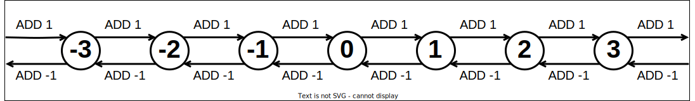

# Atomics

Now that we are acquainted with synchronization, a natural question to ask is "when do we *not* have to wait in order to communicate between threads?"
After all, how can we meaningfully use a piece of storage if we do not know what operations have already used it?

Initially, we may suspect that this is impossible, but this depends upon what we care about.
Do we care if a specific operation has occured with that sotrage, or do we only care that the *side effects* of each operation carries over to subsequent operations?

If we only care about preserving side effects, the order of these operations is not as important.

## The Basics

An atomic operation is an operation that is *indivisible* to all relevant observers. {{footnote: This relates to the original theory of atoms, which thought of atoms as indivisible units of matter.}}
While an atomic operation could succeed or fail, it may never be observed as partway through execution.

A classic example of non-atomicity, and how that can cause problems, is the multiple-adders scenario shown in the [synchronization](./sync.md) sub-chapter:

```cpp
{{#include ./sync/mutex_test_0.cpp}}
```

The central reason *why* we needed to use synchronization was that the `++` operation was **not atomic**.

Typically, atomic APIs represent atomic operations as acting on some object in memory (**A**) given a set of operands (**B**, **C**, ...), returning the original value of that object (**X**) immediately prior to whatever occurs with the operation.

```cpp
// An int, wrapped by C++'s atomic template, which provides atomic operations
std::atomic<int> A = 1;
int B = 2;

int X = A.fetch_add(B);
// Unless another thread has already modified A, X should be given the value 1.
```

In cases where OOP paradigms are not used by the API, a reference/pointer to the object is generally used in place of a wrapper type:
```cpp
int A = 1;
int B = 2;

// A prototypical procedural interface for atomic addition
int X = atomic_add(&A,B);
```

## Interpreting Output

The inclusion of a return value, and the fact that this return value is the value from *immediately before the operation* is important.
Normally, if a thread reads and writes the same place in memory as another thread, there are no guarantees that the value read by one thread will reflect the actions of other threads upon that storage.

In contrast, *if all operations on a piece of storage are atomic*, then the value returned by each atomic operation should show the combined effects of all prior atomic operations up to that point.
Furthermore, if we know the definition of the operation being applied atomically, we can reconstruct the stored result value by performing the operation locally.

```cpp
std::atomic<int> A = 1;
int B = 2;

// The original value was X
int X = A.fetch_add(B);

// The new value is Y
int Y = X + B;
```

This approach gives us a small "snapshot" of the shared value's life, showing a single transition from one state to another state.


Importantly, unless we are applying mathematical/algorithmic tricks to guarantee otherwise, **we can only interpret this transition in isolation**.
For example, if we performed two atomic additions in a row and determined that these two transitions occurred:


it would be very tempting to think that something like this occurred


but this sequence of state transitions is also possible!


We cannot distinguish between an object *staying* as a value and that object *returning* to that value before the next time we use it.
This is known as the ABA problem, and it has caused countless problems for unwary parallel programmers.
As you venture into atomics, always keep the ABA problem in mind, lest you suffer a terrible fate.

## Atomic Addition

With this transition-based model in mind, how can we think of atomic addition?
To limit the set of transitions to something reasonable, let's only think about adding 1 and adding -1.


<!--slider split-->

With these two possible inputs into an atomic addition, we can reliably move a value up and down the number line.
By adding 1, we may move the state up by one position on the number line.
Likewise, adding -1 moves the state down by one position on the number line.

Note that we may not be able to guarantee what original state we are adding to or subtracting from.
Without any algorithmic guarantees, we can only enforce relative movement, rather than absolute position.


### Sempaphores through Atomics

A classic use case of atomic addition is semaphores.
As shown in the synchronization sub-chapter, semphores operate through basic additions and subtractions of a counter.


The number we add to the counter (1 or -1) is determined by the action being performed on the semaphore.

When a thread attempts to acquire a semaphore, -1 is added to the counter.
If the original value was positive, the thread may continue normally.
Otherwise, the thread must wait until it is given a slot by a thread that has already acquired the semaphore.

When a thread releases a semaphore, 1 is added to the counter.
If the original value was non-negative, the thread may contineu normally.
Otherwise, the thread must wake up one thread waiting on the semaphore, giving its slot to the awakened thread.

Note that, under this scheme, threads choose the *type* of transition based upon the action they need to perform, but they cannot control the *specific* transition they will cause.
An important part of programming with atomics is knowing what different state transitions mean and providing logic to resolve the responsibility that comes with each transition.
<!--slider split-->


### Forbidden States

We have previously mentioned providing *algorithmic guarantees* to enforce specific rules on our state transitions.
What if we don't have these guarantees?
Can we potentially react to invalid state transitions?

A **binary sempahore** is a semaphore that starts with a counter set to 1, representing only 1 resource slot.
A binary semaphore is essentially a slightly more powerful version of a mutex.
Whereas a mutex must always be unlocked by the thread that locked it, a binary semaphore may be released by any thread.

For obvious reasons, we do not want to let multiple threads acquire the semaphore at the same time.
What could we need to do to guarantee this?


One potential option is to require the user to never release the semaphore in a way that would make the counter go above 1.
If a program violates this rule, we could specify in our documentation that this results in "undefined behavior".
This option, while perhaps a little lame, is a tried and true practice in many software projects.

However, what if our library is being used for an important application which must have proper behavior even if the people use it poorly?
We could just use a mutex instead of atomics, but what if we don't have a good mutex implementation available?

Assuming we aren't equipped with other fancy atomic instructions (such as atomic and/or) which can solve this prolem more appropriately, we can *look at the transition we performed* and *negate the invalid transition*. Specifically, if a release action ever takes the counter above 1, the release implementation should detect this and immediately decrement the counter.

This solution seems okay, but it opens up a potential hazard: what if a thread attempts to acquire the semaphore after the bad increment occurs and before the fixing decrement occurs? Also, what if a third thread also attempts to acquire the semaphore after this?

If there is a third thread, its decrement would look like a valid acquisition, and if the fixing decrement occurs before the third thread releases, the third thread would attempt to wake a sleeping thread. Given this, a valid solution would be to have acquisition attempts put threads to sleep if the counter is initially in a forbidden state.

However, what if there is no third thread, or (equivalently) what if some combination of acquisitions and releases results in the counter reaching 1 immediately before the fixing decrement occurs? In this case, there must be at least one thread waiting on the semaphore, and the fixing decrement has effectively claimed the sempahore on its behalf. The thread performing the fixing decrement simply needs to wake one thread before its bad acquisition attempt resolves.

<!--slider split-->

### Implementing a Barrier?

Armed with this knowledge of atomic addition, we may be tempted to implement a barrier with simple addition and subtraction.
For example, consider the scheme illustrated below.


With this scheme:
- Threads waiting on the barrier decrement the counter
- Threads that decrement the counter at or below zero increment the counter above 1

This scheme assumes that when you decrement below zero, then the decrementing thread must be the last to arrive during a "phase" of synchronization involving the barrier.
However, what if the set of threads that use a barrier change between phases? This could mean that a thread belonging to the next phase could arrive at the barrier and decrement the counter before the previous phase is resolved. If this were the case, and if we were applying this scheme, then that thread would think it was also the last thread in its phase and increment the counter, leading to the counter entering the forbidden zone when the true final thread of the phase performs its increment, leading to potential deadlock.

To fix this issue, we may be tempted to fix things like the binary semaphore, but this does not work because we cannot treat decrements to this counter interchangeably.
A decrement by a thread belonging to the current phase is not equivalent to a decrement by a thread belonging to the next phase.
In order to distinguish between these transactions, we either need to keep different counters for adjacent phases of the barrier or force threads to wait until the current phase is fully resolved before performing a decrement.

<!--slider split-->

## Atomic And/Or

While atomic addition moves a state along the number line, atomic and/or operations can flip individual bits independently.
Much like with atomic addition, there are too many possible transitions to illustrate clearly, so let use focus on the operations that affect individual bits.
In addition, let us further constrain the state space by imagining that we are working with a two-bit integer.


<!--slider slide-->
<div style="width:40%; margin: auto;">
<!--slider web-->
<div style="width:80%; margin: auto;">
<!--slider both-->


</div>


<!--slider split-->

We can see that **or** operations cause transitions which either increase the number of 1 bits or (if the set of 1 bits in the argument are already set in the state) maintains the number of 1 bits.
Likewise, **and** operation cause transitions that decrease or maintain the number of 1 bits in the state.

<!--slider slide-->
<div style="width:40%; margin: auto;">
<!--slider web-->
<div style="width:80%; margin: auto;">
<!--slider both-->


</div>
<!--slider split-->

If we model an **N**-bit state as an **N**-dimensional cube, each bit represents a unique dimension along this cube and selecting between **and** and **or** operations is essentially selecting between moving **down** or **up** each dimension in our state space.
Given this, by carefully selecting our operation and argument, we can "bump" up or down any dimension in our state we wish.
If the corresponding dimension's bit is already zero when we **and** or is already one when we **or**, this is like running into a wall.
We can no longer move further along that dimension and instead stay where we are.

<!--slider slide-->
<div style="width:40%; margin: auto;">
<!--slider web-->
<div style="width:80%; margin: auto;">
<!--slider both-->


</div>
<!--slider split-->

Using this scheme, we can easily implement an allocator across a set of **N** objects using an **N**-bit state, with the allocation of each object represented by the value of a unique bit.
This allocator would also allow us to gracefully react to double-allocations and double-frees, since we can detect when an object has already been allocated/freed based off of the original state.

<!--slider slide-->
<div style="width:40%; margin: auto;">
<!--slider web-->
<div style="width:80%; margin: auto;">
<!--slider both-->


</div>
<!--slider split-->


## Atomic Exchange


An atomic exchange operation is essentially a swapping operation.
The argument that is supplied to the operation is written to the state, and the original state is returned.

<!--slider slide-->
<div style="width:40%; margin: auto;">
<!--slider web-->
<div style="width:80%; margin: auto;">
<!--slider both-->


</div>
<!--slider split-->

As simple as it is, an atomic exchange is quite useful.
For example, an atomic exchange can be used on a pointer type or an integer type representing an integer ID, and by swapping these pointers/ids, we can represent the swapping of the objects represented by those pointers IDs.
This means that the atomic state can act as a "holding area" for these larger objects, with the atomic swap guaranteeing that each handle can only be claimed by one thread.
In cases where no object is "held" by a state, a null ID/pointer may be used.

<!--slider slide-->
<div style="width:40%; margin: auto;">
<!--slider web-->
<div style="width:80%; margin: auto;">
<!--slider both-->


</div>
<!--slider split-->


## Atomic Compare and Exchange

Finally, there is the most powerful atomic operation of all: the atomic compare and exchange operation (aka "CAS" - compare and swap).

A compare and exchange operation is a conditional version of an atomic exchange, writing one argument to the state if that state matches a second argument.

<!--slider slide-->
<div style="width:40%; margin: auto;">
<!--slider web-->
<div style="width:80%; margin: auto;">
<!--slider both-->


</div>
<!--slider split-->

As we can see below, the only transitions leading to a state have a second argument matching that state, and the only transitions leaving a state have a comparison argument matching that state.

<!--slider slide-->
<div style="width:40%; margin: auto;">
<!--slider web-->
<div style="width:80%; margin: auto;">
<!--slider both-->


</div>
<!--slider split-->


If the comparison argument does not match the original state, the other argument is not written.

<!--slider slide-->
<div style="width:40%; margin: auto;">
<!--slider web-->
<div style="width:80%; margin: auto;">
<!--slider both-->


</div>
<!--slider split-->

This mechanism allows us to implement arbitrary atomic operations by reading the current state, calculating the desired state after our operation is applied, and performing a CAS with the read state and the desired states as arguments.
For example, below we implement an atomic max function on a two-bit integer.

<!--slider slide-->
<div style="width:40%; margin: auto;">
<!--slider web-->
<div style="width:80%; margin: auto;">
<!--slider both-->


</div>
<!--slider split-->

Here, we implement an atomic add-1 operation with overflow on a two-bit integer.

<!--slider slide-->
<div style="width:40%; margin: auto;">
<!--slider web-->
<div style="width:80%; margin: auto;">
<!--slider both-->


</div>
<!--slider split-->

Here, we implement an atomic add-2 operation with overflow on a two-bit integer.

<!--slider slide-->
<div style="width:40%; margin: auto;">
<!--slider web-->
<div style="width:80%; margin: auto;">
<!--slider both-->


</div>


However, note that the comparison argument is not guaranteed to match the state when we actually apply the operation.
Another atomic operation could be performed between our read and or CAS, leading to a failed CAS.
If this occurs, we can simply try again until our CAS does work, but this does mean that we can be delayed when attempting to use CAS operations in this way.
If we are unlucky enough, a thread could take an arbitrary amount of attempts to be successful, so we need to be careful about how we use this strategy.


