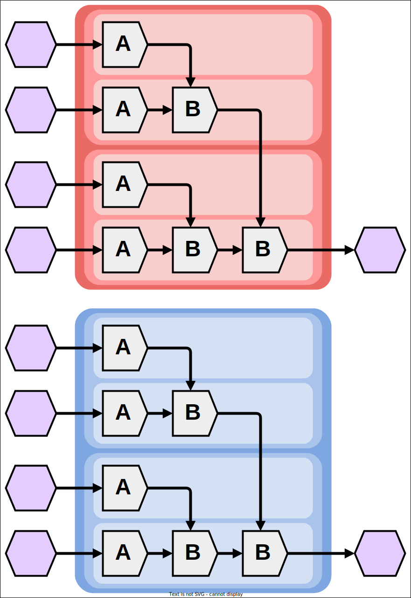
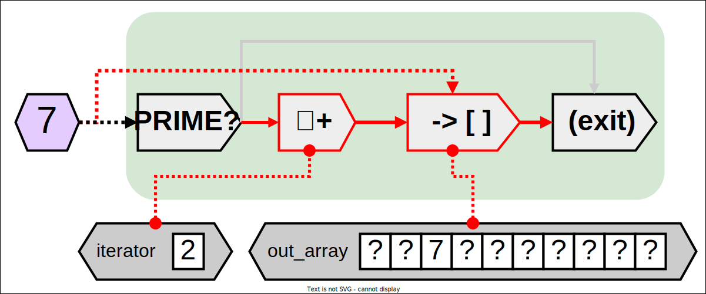

# Communication and Synchronization

## Embarrassingly Parallel Work


As a rule, embarrassingly parallel work does not require any significant communication between sub-tasks.
For example, this kernel would be considered embarrassingly parallel:

```cpp
{{#include ./comm/embarrass.cu}}
```

Embarrassingly parallel work is great, since less communication means less communication overhead.
If the `A` and `B` functions are themselves embarrassingly parallel, one can expect such a kernel to use their processing hardware quit well.

<div style="width: 70%; margin: auto;">


</div>

Of course, embarrassing parallelism does not guarantee that adjacent threads cannot affect each other. Divergence is still a factor.
For example, this kernel performs half the calculations of the previous kernel, but alternates its phase in `A`/`B` execution across threads:

```cpp
{{#include ./comm/emb_mixed.cu}}
```

While it would be great if processing could overlap like this:

<div style="width: 70%; margin: auto;">


</div>

Realistically, both sides of the if statement would cause half of all threads to idle:

<div style="width: 70%; margin: auto;">


</div>

To reduce this overhead, one could apply clever tricks to reduce divergence.
For this particular function, this alternate implementation represents the same behavior but in a way which causes fewer divergent paths:

```cpp
{{#include ./comm/emb_fixed.cu}}
```

This alternate implementation exploits the fact that all threads are performing the same work, aside from the first/final calls to `A` made by even/odd threads:

<div style="width: 70%; margin: auto;">


</div>

## Local Storage

In cases where a value is only used by one thread, such as the variables used by embarassingly parallel work, that value should be kept in local storage (aka private storage).

As noted [in the SIMT Basics sub-chapter](./simt.md), multiprocessors use registers to track the values that are not shared between threads.
These registers are what serve as local storage.
By default, variables declared in `__global__`/`__device__` functions are local.
This is good, because it means that developers must explicitly opt into the overhead and side-effects of `__shared__` or global storage, leading to fewer surprises.

## Shared Storage

In addition to local storage, there is `__shared__` storage.
Variables which are declared with `__shared__` storage are tracked by a single copy per block, with all threads in that block capable of reading and writing to it.

Shared storage can be used to communicate synchronously or asynchronously with other threads in the same block.

### Asynchronous Intra-Block Communication

Asynchronous communication is typically handled through atomic operations.
CUDA provides atomic operations through functions such as [atomicAdd](https://docs.nvidia.com/cuda/cuda-c-programming-guide/index.html#atomicadd).

Generally speaking, the behavior of atomics in SIMT processing platforms matches with their behavior in CPU processing.

### Synchronous Intra-Block Communication

As noted [in the SIMT Basics sub-chapter](./simt.md), all warps in a block are managed by the same multiprocessor, and that multiprocessor can selectively delay the scheduling of warps under its control to allow those warps to synchronize.
In CUDA, the `__syncthreads()` function allows programs to control this synchronization.

In essence, this function acts as a sort of per-block barrier.
Each thread that calls `__syncthreads()` must wait until all threads in its block have also called `__syncthreads()` before execution can continue.
If some threads fail to call `__syncthreads()`, a deadlock is likely to occur.


Here is a program which performs a map-reduction across all threads in each block:


<div style="height: 30em; overflow: scroll;">

```cpp
{{#include ./comm/local_reduce_simplified.cu}}
```

</div>

Below is an illustration of the dependencies in the kernel.

<div style="width: 50%; margin: auto;">



</div>

Note that, since `__syncthreads()` only works across threads in the same block, each block may independently perform their reduction in an arbitrary order.
Also note that the program shown above is storing essentially all intermediate values in shared memory.
With some additional effort, unnecessary stores to shared memory can be eliminated like so:


<div style="height: 30em; overflow: scroll;">

```cpp
{{#include ./comm/local_reduce.cu}}
```

</div>


## Global Storage

Global storage is storage that is held in global memory.
Variables that are in global storage are tracked as a single instance, with all threads in a kernel able to access this instance.

Typically, global storage is created through device memory allocation functions such as `cudaMalloc`.
Alternatively, one can declare global variables with the `__device__` qualifier and, if no further storage qualifies are provided, that variable will be stored in global memory by default.
As with CPU programs, globally-scoped variables introduce a number of hazards and can lead to technical debt, so caution is advised with their use.
Here, we will focus on using allocated global storage.


## Synchronous Inter-Block Communication

One may be tempted to tweak our previous per-block reduction program to create a kernel-wide reduction, like so:


<div style="height: 30em; overflow: scroll;">

```cpp
{{#include ./comm/global_reduce_naive.cu}}
```

</div>

Whenever communication occurs between blocks, one should use caution.
Remember that `__syncthreads()` does not work across blocks - it only synchronizes within a block.

<div style="width: 50%; margin: auto;">


</div>

With how powerful modern GPU hardware is, many threads can fit into the same block.
This is good, but it can also trick developers into thinking that their communication is safe when it is not.
It is common for developers to test programs with relatively small amounts of data to make them easier to debug, but the lack of synchronization between blocks only becomes an issue when a kernel has more than one block to begin with.

If a CUDA program scales the number of blocks used by the amount of data to be processed, then the trivial examples typically tested by developers will accidentally avoid the conditions that can cause the most difficult bugs to solve.

With the program shown above, the lack of synchronization between blocks only becomes apparent when the amount of data rises above the block size:

```console
$ ./global_reduce_naive 16
The input:
3,6,7,5,3,5,6,2,9,1,2,7,0,9,3,6
The output, after reducing the entire array:
148
$ ./global_reduce_naive 1024
The input:
(input array printout is omitted, since it is very long)
The output, after reducing the entire array:
9286
$ ./global_reduce_naive 65536
The output, after reducing the entire array:
18314
Error: 18314 != 588374
```

### Synchronizing the Hard Way

There is no easy way to synchronize across all threads in a kernel{{footnote: in a generalizable, cross-platform way}}, but this effect can be emulated by breaking up the work across more than one kernel dispatch (aka `__global__` function call).

<div style="width: 70%; margin: auto;">


*To make the type of more communication obvious, private-memory values are represented in solid lines, communication through shared memory is represented through dashed lines, and communication through global memory is represented through dotted lines.*

</div>


Whenever the host calls `cudaDeviceSynchronize`, it waits for all relevant kernels to complete their work.
A kernel is only considered complete after all threads in that kernel has exited (or the kernel crashed).
So, by calling `cudaDeviceSynchronize`, one is effectively having the host wait on a barrier which all threads in relevant kernels will "reach" upon exiting.
After this occurs, the host can perform a new kernel dispatch, and the threads in that new kernel dispatch are guaranteed to see the side effects of all threads from the previous kernel dispatch.

Here is a revised version of the previous, naive global reduction program which works:

<div style="height: 30em; overflow: scroll;">

```cpp
{{#include ./comm/global_reduce_simple.cu}}
```
</div>

This implementation extracts the for loop from the kernel and moves it to the `main` function.
For each iteration that would occur in the device, the host now performs an iteration, with the corresponding `i` value supplied as a parameter to the kernel call.

While this does work, it is rather inefficient, and synchronizes for every iteration.
Instead, it would make more sense to perform a blocks-worth of reduction on block-sized chunks, then continue reduction over the output array block-wise totals:

<div style="height: 30em; overflow: scroll;">

```cpp
{{#include ./comm/global_reduce.cu}}
```
</div>

This implementation is essentially using the old per-block reduction technique, but is chaining multiple calls to the kernel to compose a larger, global reduction out of a patchwork of smaller, local reductions.
To give a better idea of this technique, this implementation has `BLOCK_SIZE` set to 2, and all inputs provided are set to 1, rather than being randomly generated.
With these tweaks, it is plain to see the mechanism of operation:

```console
$ ./global_reduce 1024
1,1,1,1,1,1,1,1,1,1,1,1,1,1,1,1,1,1,1,1,1,1,1,1,1,1,1,1,1,1,1,1,1,1,1,1,1,1,1,1,1,1,1,1,1,1,1,1,1,1,1,1,1,1,1,1,1,1,1,1,1,1,1,1,1,1,1,1,1,1,1,1,1,1,1,1,1,1,1,1,1,1,1,1,1,1,1,1,1,1,1,1,1,1,1,1,1,1,1,1,1,1,1,1,1,1,1,1,1,1,1,1,1,1,1,1,1,1,1,1,1,1,1,1,1,1,1,1,1,1,1,1,1,1,1,1,1,1,1,1,1,1,1,1,1,1,1,1,1,1,1,1,1,1,1,1,1,1,1,1,1,1,1,1,1,1,1,1,1,1,1,1,1,1,1,1,1,1,1,1,1,1,1,1,1,1,1,1,1,1,1,1,1,1,1,1,1,1,1,1,1,1,1,1,1,1,1,1,1,1,1,1,1,1,1,1,1,1,1,1,1,1,1,1,1,1,1,1,1,1,1,1,1,1,1,1,1,1,1,1,1,1,1,1,1,1,1,1,1,1,1,1,1,1,1,1,1,1,1,1,1,1,1,1,1,1,1,1,1,1,1,1,1,1,1,1,1,1,1,1,1,1,1,1,1,1,1,1,1,1,1,1,1,1,1,1,1,1,1,1,1,1,1,1,1,1,1,1,1,1,1,1,1,1,1,1,1,1,1,1,1,1,1,1,1,1,1,1,1,1,1,1,1,1,1,1,1,1,1,1,1,1,1,1,1,1,1,1,1,1,1,1,1,1,1,1,1,1,1,1,1,1,1,1,1,1,1,1,1,1,1,1,1,1,1,1,1,1,1,1,1,1,1,1,1,1,1,1,1,1,1,1,1,1,1,1,1,1,1,1,1,1,1,1,1,1,1,1,1,1,1,1,1,1,1,1,1,1,1,1,1,1,1,1,1,1,1,1,1,1,1,1,1,1,1,1,1,1,1,1,1,1,1,1,1,1,1,1,1,1,1,1,1,1,1,1,1,1,1,1,1,1,1,1,1,1,1,1,1,1,1,1,1,1,1,1,1,1,1,1,1,1,1,1,1,1,1,1,1,1,1,1,1,1,1,1,1,1,1,1,1,1,1,1,1,1,1,1,1,1,1,1,1,1,1,1,1,1,1,1,1,1,1,1,1,1,1,1,1,1,1,1,1,1,1,1,1,1,1,1,1,1,1,1,1,1,1,1,1,1,1,1,1,1,1,1,1,1,1,1,1,1,1,1,1,1,1,1,1,1,1,1,1,1,1,1,1,1,1,1,1,1,1,1,1,1,1,1,1,1,1,1,1,1,1,1,1,1,1,1,1,1,1,1,1,1,1,1,1,1,1,1,1,1,1,1,1,1,1,1,1,1,1,1,1,1,1,1,1,1,1,1,1,1,1,1,1,1,1,1,1,1,1,1,1,1,1,1,1,1,1,1,1,1,1,1,1,1,1,1,1,1,1,1,1,1,1,1,1,1,1,1,1,1,1,1,1,1,1,1,1,1,1,1,1,1,1,1,1,1,1,1,1,1,1,1,1,1,1,1,1,1,1,1,1,1,1,1,1,1,1,1,1,1,1,1,1,1,1,1,1,1,1,1,1,1,1,1,1,1,1,1,1,1,1,1,1,1,1,1,1,1,1,1,1,1,1,1,1,1,1,1,1,1,1,1,1,1,1,1,1,1,1,1,1,1,1,1,1,1,1,1,1,1,1,1,1,1,1,1,1,1,1,1,1,1,1,1,1,1,1,1,1,1,1,1,1,1,1,1,1,1,1,1,1,1,1,1,1,1,1,1,1,1,1,1,1,1,1,1,1,1,1,1,1,1,1,1,1,1,1,1,1,1,1,1,1,1,1,1,1,1,1,1,1,1,1,1,1,1,1,1,1,1,1,1,1,1,1,1,1,1,1,1,1,1,1,1,1,1,1,1,1,1,1,1,1,1,1,1,1,1,1,1,1,1,1,1,1,1,1,1,1,1,1,1,1,1,1,1,1,1,1,1,1,1,1,1,1,1,1,1,1,1,1,1,1,1,1,1,1,1,1,1,1,1,1,1,1,1,1,1,1,1,1,1,1,1,1,1,1,1,1,1,1,1,1,1,1,1,1,1,1,1,1,1,1,1,1,1,1,1,1,1,1,1,1,1,1,1,1,1,1,1,1,1,1,1,1,1,1,1,1,1,1,1,1,1,1,1,1,1,1,1,1,1,1,1,1,1,1,1,1,1,1,1,1,1,1,1,1,1,1,1,1,1,1,1,1,1,1,1,1,1
2,2,2,2,2,2,2,2,2,2,2,2,2,2,2,2,2,2,2,2,2,2,2,2,2,2,2,2,2,2,2,2,2,2,2,2,2,2,2,2,2,2,2,2,2,2,2,2,2,2,2,2,2,2,2,2,2,2,2,2,2,2,2,2,2,2,2,2,2,2,2,2,2,2,2,2,2,2,2,2,2,2,2,2,2,2,2,2,2,2,2,2,2,2,2,2,2,2,2,2,2,2,2,2,2,2,2,2,2,2,2,2,2,2,2,2,2,2,2,2,2,2,2,2,2,2,2,2,2,2,2,2,2,2,2,2,2,2,2,2,2,2,2,2,2,2,2,2,2,2,2,2,2,2,2,2,2,2,2,2,2,2,2,2,2,2,2,2,2,2,2,2,2,2,2,2,2,2,2,2,2,2,2,2,2,2,2,2,2,2,2,2,2,2,2,2,2,2,2,2,2,2,2,2,2,2,2,2,2,2,2,2,2,2,2,2,2,2,2,2,2,2,2,2,2,2,2,2,2,2,2,2,2,2,2,2,2,2,2,2,2,2,2,2,2,2,2,2,2,2,2,2,2,2,2,2,2,2,2,2,2,2,2,2,2,2,2,2,2,2,2,2,2,2,2,2,2,2,2,2,2,2,2,2,2,2,2,2,2,2,2,2,2,2,2,2,2,2,2,2,2,2,2,2,2,2,2,2,2,2,2,2,2,2,2,2,2,2,2,2,2,2,2,2,2,2,2,2,2,2,2,2,2,2,2,2,2,2,2,2,2,2,2,2,2,2,2,2,2,2,2,2,2,2,2,2,2,2,2,2,2,2,2,2,2,2,2,2,2,2,2,2,2,2,2,2,2,2,2,2,2,2,2,2,2,2,2,2,2,2,2,2,2,2,2,2,2,2,2,2,2,2,2,2,2,2,2,2,2,2,2,2,2,2,2,2,2,2,2,2,2,2,2,2,2,2,2,2,2,2,2,2,2,2,2,2,2,2,2,2,2,2,2,2,2,2,2,2,2,2,2,2,2,2,2,2,2,2,2,2,2,2,2,2,2,2,2,2,2,2,2,2,2,2,2,2,2,2,2,2,2,2,2,2,2,2,2,2,2,2,2,2,2,2,2,2,2,2,2,2,2,2,2,2,2,2,2,2,2,2,2,2,2,2,2,2,2,2,2,2,2,2,2,2,2,2,2,2,2,2,2,2,2,2,2,2,2,2,2,2,2,2,2,2,2,2,2,2,2,2,2,2,2,2,2,2,2,2,2,2,2,2,2,2,2,2,2,2,2,2,2,2,2,2,2,2,2,2,2,2,2,2,2,2,2,2,2,2,2,2,2,2,2,2,2,2,2,2,2,2,2,2,2,2,2,2,2,2,2,2,2,2,2,2,2,2,2,2,2,2,2,2,2,2,2,2,2,2,2,2,2,2,2,2,2,2,2,2,2,2,2,2,2,2,2,2,2,2,2,2,2,2,2,2,2,2,2,2,2,2,2,2,2,2,2,2,2,2,2,2,2,2,2,2,2,2,2,2,2,2,2,2,2,2,2,2,2,2,2,2,2,2,2,2,2,2,2,2,2,2,2,2,2,2,2,2,2,2,2,2,2,2,2,2,2,2,2,2,2,2,2,2,2,2,2,2,2,2,2,2,2,2,2,2,2,2,2,2,2,2,2,2,2,2,2,2,2,2,2,2,2,2,2,2,2,2,2,2,2,2,2,2,2,2,2,2,2,2,2,2,2,2,2,2,2,2,2,2,2,2,2,2,2,2,2,2,2,2,2,2,2,2,2,2,2,2,2,2,2,2,2,2,2,2,2,2,2,2,2,2,2,2,2,2,2,2,2,2,2,2,2,2,2,2,2,2,2,2,2,2,2,2,2,2,2,2,2,2,2,2,2,2,2,2,2,2,2,2,2,2,2,2,2,2,2,2,2,2,2,2,2,2,2,2,2,2,2,2,2,2,2,2,2,2,2,2,2,2,2,2,2,2,2,2,2,2,2,2,2,2,2,2,2,2,2,2,2,2,2,2,2,2,2,2,2,2,2,2,2,2,2,2,2,2,2,2,2,2,2,2,2,2,2,2,2,2,2,2,2,2,2,2,2,2,2,2,2,2,2,2,2,2,2,2,2,2,2,2,2,2,2,2,2,2,2,2,2,2,2,2,2,2,2,2,2,2,2,2,2,2,2,2,2,2,2,2,2,2,2,2,2,2,2,2,2,2,2,2,2,2,2,2,2,2,2,2,2,2,2,2,2,2,2,2,2,2,2,2,2,2,2,2,2,2,2,2,2,2,2,2,2,2,2,2
4,4,4,4,4,4,4,4,4,4,4,4,4,4,4,4,4,4,4,4,4,4,4,4,4,4,4,4,4,4,4,4,4,4,4,4,4,4,4,4,4,4,4,4,4,4,4,4,4,4,4,4,4,4,4,4,4,4,4,4,4,4,4,4,4,4,4,4,4,4,4,4,4,4,4,4,4,4,4,4,4,4,4,4,4,4,4,4,4,4,4,4,4,4,4,4,4,4,4,4,4,4,4,4,4,4,4,4,4,4,4,4,4,4,4,4,4,4,4,4,4,4,4,4,4,4,4,4,4,4,4,4,4,4,4,4,4,4,4,4,4,4,4,4,4,4,4,4,4,4,4,4,4,4,4,4,4,4,4,4,4,4,4,4,4,4,4,4,4,4,4,4,4,4,4,4,4,4,4,4,4,4,4,4,4,4,4,4,4,4,4,4,4,4,4,4,4,4,4,4,4,4,4,4,4,4,4,4,4,4,4,4,4,4,4,4,4,4,4,4,4,4,4,4,4,4,4,4,4,4,4,4,4,4,4,4,4,4,4,4,4,4,4,4,4,4,4,4,4,4,4,4,4,4,4,4,4,4,4,4,4,4,4,4,4,4,4,4,4,4,4,4,4,4,4,4,4,4,4,4,4,4,4,4,4,4,4,4,4,4,4,4,4,4,4,4,4,4,4,4,4,4,4,4,4,4,4,4,4,4,4,4,4,4,4,4,4,4,4,4,4,4,4,4,4,4,4,4,4,4,4,4,4,4,4,4,4,4,4,4,4,4,4,4,4,4,4,4,4,4,4,4,4,4,4,4,4,4,4,4,4,4,4,4,4,4,4,4,4,4,4,4,4,4,4,4,4,4,4,4,4,4,4,4,4,4,4,4,4,4,4,4,4,4,4,4,4,4,4,4,4,4,4,4,4,4,4,4,4,4,4,4,4,4,4,4,4,4,4,4,4,4,4,4,4,4,4,4,4,4,4,4,4,4,4,4,4,4,4,4,4,4,4,4,4,4,4,4,4,4,4,4,4,4,4,4,4,4,4,4,4,4,4,4,4,4,4,4,4,4,4,4,4,4,4,4,4,4,4,4,4,4,4,4,4,4,4,4,4,4,4,4,4,4,4,4,4,4,4,4,4,4,4,4,4,4,4,4,4,4,4,4
8,8,8,8,8,8,8,8,8,8,8,8,8,8,8,8,8,8,8,8,8,8,8,8,8,8,8,8,8,8,8,8,8,8,8,8,8,8,8,8,8,8,8,8,8,8,8,8,8,8,8,8,8,8,8,8,8,8,8,8,8,8,8,8,8,8,8,8,8,8,8,8,8,8,8,8,8,8,8,8,8,8,8,8,8,8,8,8,8,8,8,8,8,8,8,8,8,8,8,8,8,8,8,8,8,8,8,8,8,8,8,8,8,8,8,8,8,8,8,8,8,8,8,8,8,8,8,8,8,8,8,8,8,8,8,8,8,8,8,8,8,8,8,8,8,8,8,8,8,8,8,8,8,8,8,8,8,8,8,8,8,8,8,8,8,8,8,8,8,8,8,8,8,8,8,8,8,8,8,8,8,8,8,8,8,8,8,8,8,8,8,8,8,8,8,8,8,8,8,8,8,8,8,8,8,8,8,8,8,8,8,8,8,8,8,8,8,8,8,8,8,8,8,8,8,8,8,8,8,8,8,8,8,8,8,8,8,8,8,8,8,8,8,8,8,8,8,8,8,8,8,8,8,8,8,8
16,16,16,16,16,16,16,16,16,16,16,16,16,16,16,16,16,16,16,16,16,16,16,16,16,16,16,16,16,16,16,16,16,16,16,16,16,16,16,16,16,16,16,16,16,16,16,16,16,16,16,16,16,16,16,16,16,16,16,16,16,16,16,16,16,16,16,16,16,16,16,16,16,16,16,16,16,16,16,16,16,16,16,16,16,16,16,16,16,16,16,16,16,16,16,16,16,16,16,16,16,16,16,16,16,16,16,16,16,16,16,16,16,16,16,16,16,16,16,16,16,16,16,16,16,16,16,16
32,32,32,32,32,32,32,32,32,32,32,32,32,32,32,32,32,32,32,32,32,32,32,32,32,32,32,32,32,32,32,32,32,32,32,32,32,32,32,32,32,32,32,32,32,32,32,32,32,32,32,32,32,32,32,32,32,32,32,32,32,32,32,32
64,64,64,64,64,64,64,64,64,64,64,64,64,64,64,64,64,64,64,64,64,64,64,64,64,64,64,64,64,64,64,64
128,128,128,128,128,128,128,128,128,128,128,128,128,128,128,128
256,256,256,256,256,256,256,256
512,512,512,512
1024,1024
2048
```

Since the block size is two, the size of the output array shrinks by a factor of 2 with each kernel call.
In addition, since each input element is the same for a given kernel call, the output values are all doubles of the input values.

In practice, `BLOCK_SIZE` should be much larger in order to fully use the hardware of the executing device.

### Asynchronous Reduction with Atomics

Alternatively, one could use atomics to perform communication between blocks.
The use of atomics is quite powerful for inter-block communication mainly *because* it does not require synchronization, and so does not require operations to be broken up across multiple kernel dispatches.

Here is an atomics-based global reduction, with some block-wise reduction included to keep things efficient:


<div style="height: 30em; overflow: scroll;">

```cpp
{{#include ./comm/global_atomic_reduce.cu}}
```
</div>

A diagram of what this implementation is generally doing:

<div style="width: 70%; margin: auto;">


</div>

Each block still performs its per-block reduction, but each per-block total is atomically added to a global total, instead of going through further rounds of reduction.

## A Different Problem: Scanning

Reduction is only one application out of many, and it may present a rather optimistic view of atomics-based communication in a vaccuum.

With scanning, atomics are less of a viable alternative to synchronization, since the output encompasses many values that rely upon different subsets of the same parallel operations.

For example, assuming an architecture with 2 threads per warp and kernels with 2 warps per block, the following would be the dependency graph of a possible on-GPU prefix-sum program processing an array of size 16:

<div style="width: 70%; margin: auto;">


</div>

A general description of this algorithm is as follows:

1. To begin, each block-sized segment of the array is processed through a local prefix scan.
2. From there, a prefix scan is performed over the final values of each prefix scan.
3. The (N+1)th value of this second "tier" of this scan is then added to each value in the Nth block-sized segment in the first "tier", thus completing the prefix scan.

There are several things that are good about this algorithm:
- It segments the job into "chunks" of work that are well suited to the size of a block
- It is scalable: additional "tiers" may be added to deal with larger arrays, with N tiers capable of scanning up to 4^N values

However, it cannot be easily translated into atomics.
Any tier beyond the first could potentially be replaced by having each block atomically add its total to the output values of all elements after it.
This would require a separate output buffer to accumulate into in order to avoid race conditions.
This would also result in O(N^2) atomic operations for an array of size N, which is not scalable and would result in bottlenecking around memory bandwidth.
In this case, paying the price of global synchronization is likely the better strategy.

## Producer-Consumer Patterns

Another common issue with communication is the need to process sets of data which are unpredictable in quantity and origin.

For example, what if one wished to find all primes less than some number.
Predicting the precise quantity of primes below a certain value is very difficult {{footnote: unless some very dramatic developments occur in the field of mathematics}}.
Predicting which numbers are prime is similarly quite difficult.
Hence, if one wished to test many values for primality in parallel and accumulate a list of prime numbers, one could not simply assign output elements ahead-of-time.

One solution would be to generate an array of boolean prime-or-not results, then perform a scan counting true results to assign indexes in the output list.
This solution is not ideal, since it requires the storage of information for values that should be filtered out of the output list.
As the ratio of output values to filtered values shrinks, the effective memory usage grows worse.
It would be better in many cases to store only the values that should be kept.

A good way of handling this is to use an atomically-incremented iterator to allocate elements in an output buffer.

Here is a rough sketch of the process:

```cpp
__device__ void give(T* array, int* iter, int size, T data) {
    int index = atomicAdd(iter,1);
    if(index >= size){
        if(index == size){
            printf("ERROR: Capacity exceeded!\n");
        }
        return;
    }
    array[index] = data;
}
```

For our example problem of building a list of primes, here is an illustration of the operations that would be performed by a thread checking a number for primality:

<div style="width: 70%; margin: auto;">


</div>

To give an example of it in operation, imagine that the thread processing the value `7` has just determined that `7` is prime.
Once this has occurred, the thread will atomically increment the iterator and use the returned value as the index to store `7` in the output array.

<div style="width: 70%; margin: auto;">


</div>

This process should be safe and reliable as long as:

- the iterator is initialized to zero
- only prime-searching threads interact with the iterator during the prime-searching process
- the prime-searching threads only atomically increment the iterator, and only for the purpose of allocating elements in the output array

Note that there are limitations to this technique:
- the array size should support the maximum expected number of outputs
- there is no guarantee of the output ordering
- each thread can only determine the index of its own output

For example, another thread processing the value `2` could get an index of `5`, resulting in it getting placed after the value `7` in output.
Hence, the ordering of output primes could be different from their order on the number line.

<div style="width: 70%; margin: auto;">


</div>

In cases where a thread's value is not prime, the output logic is never executed, meaning that no space in the output array is consumed by unnecessary values.

<div style="width: 70%; margin: auto;">


</div>


After all threads producing values have completed, another set of threads may consume values from the array by decrementing the index to claim specific elements in the array.


<div style="width: 70%; margin: auto;">


</div>

With the addition of this value-consuming logic, this array can serve as a message-passing channel between threads, allowing for convenient transmission of dynamically-generated information.

However, there is one major limitation to this message passing channel: all tasks that may potentially insert values in the array must complete before any tasks that may take value from the array may start.
If this limitation is not respected, elements would be claimed for production and insertion before the respective elements could be read from or written to.


### A Producer-Consumer Class

For reference and future use, here is a class that encapsulates the logic of such a message-passing array:

```cpp
{{#include comm/procon.h}}
```


