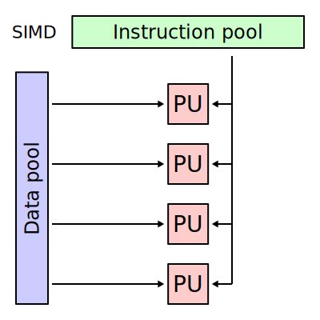
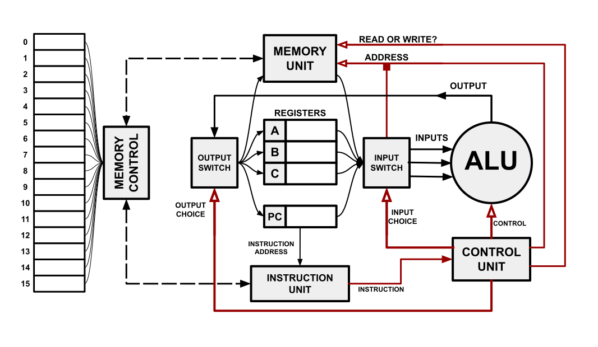
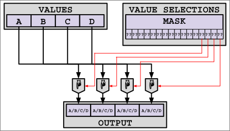

<!--slider web-->
# SIMD Processing

## The Basics

Back in the [models of parallelism sub-chapter](../intro/models.md) of the groundwork chapter, we briefly mentioned **Flynn's Taxonomy**, which established a categorization of different types of processing.

Among these categories is **SIMD**, single instruction, multiple data.
In SIMD processing, a single instruction uses multiple pieces of data as inputs and outputs, applying multiple operations across said inputs.
This is achieved by having multiple processing units (ALUs,FPUs,etc) controlled by the same instruction stream/program counter.

<div style="width: 50%; margin: auto;">


</div>

<!--slider slide-->

## The Basics

<!--slider row-split-->

Back in the [models of parallelism sub-chapter](../intro/models.md) of the groundwork chapter, we briefly mentioned **Flynn's Taxonomy**, which established a categorization of different types of processing.

 - Among these categories is **SIMD**, single instruction, multiple data.

 - In SIMD processing, a single instruction uses multiple pieces of data as inputs and outputs, applying multiple operations across said inputs.

 - This is achieved by having multiple processing units (ALUs,FPUs,etc) controlled by the same instruction stream/program counter.

<!--slider cell-split-->

<div style="width: 90%; margin: auto;">


</div>

<!--slider both-->
<!--slider split-->
<!--slider web-->

At first glance, this strategy may not be intuitive - after all, most modern personal computers usually have multiple cores evaluating independent streams of operations (an example of **MIMD**).
Considering how successful MIMD is, why would anyone wish to restrict multiple processing units to the same instruction stream? To answer this question, let's revisit our understanding of computer architecture.

Back in the [computers in a nutshell sub-chapter](../intro/computers.md) of the groundwork chapter, we sketched a high-level overview of what processors generally do:



A crucial step in processing is the decoding of instructions into the control signals that make the components of a processor perform their part of the instruction.
Control units take a significant amount of labor hours to design, a significant amount of die space (silicon) to create, and a significant amount of power to use.
These costs can certainly vary across architectures, but each additional control unit nonetheless represents additional expense for the designer, manufacturer, and user.

**SIMD avoids these costs by essentially controlling more processing hardware with fewer control units.**

Interestingly, the evaluation of SIMD instructions is an example of *parallelism without concurrency*, since all parts of a SIMD instruction are evaluated at the same instant from the perspective of the executing process.

<!--slider slide-->

## Why SIMD?

<!--slider row-split-->

The parallelism we are familiar with (MIMD) has been really successful, so why would we want to restrict multiple processors to one instuction stream?

 - Recall how machine code is executed by a computer
 - We need to **fetch** instructions, **decode** them, and then **execute** them
 - The hardware/processing needed to decode instructions can be expensive:
   - Takes time to design
   - Takes die space (silicon)
   - Takes  power
 - **SIMD avoids these costs by essentially controlling more processing hardware with fewer control units.**


<!--slider cell-split 2-->


<!--slider both-->
<!--slider split-->
<!--slider web-->

### Supplementary Resources

There are ***A LOT*** of SIMD instructions in modern processors.

Because of this, we will be providing only a high-level overview of a limited subset of the SIMD capabilities of x86 hardware.
If you are interested in learning more about SIMD instructions:

- [Here is a more comprehensive, graphical breakdown of x86 SIMD instructions.](https://db.in.tum.de/~finis/x86-intrin-cheatsheet-v2.1.pdf)

- [Here is the official Intel intrinsics guide.](https://www.intel.com/content/www/us/en/docs/intrinsics-guide/index.html)

- Also, since we are discussing machine instructions, [remember that GodBolt is a good tool for inspecting assembly.](https://godbolt.org/z/4jn9f3GKK)

<!--slider slide-->

## Supplementary Resources

There are ***A LOT*** of SIMD instructions in modern processors.

Because of this, we will be providing only a high-level overview of a limited subset of the SIMD capabilities of x86 hardware.
If you are interested in learning more about SIMD instructions:

- [Here is a more comprehensive, graphical breakdown of x86 SIMD instructions.](https://db.in.tum.de/~finis/x86-intrin-cheatsheet-v2.1.pdf)

- [Here is the official Intel intrinsics guide.](https://www.intel.com/content/www/us/en/docs/intrinsics-guide/index.html)

- Also, since we are discussing machine instructions, [remember that GodBolt is a good tool for inspecting assembly.](https://godbolt.org/z/4jn9f3GKK)


<!--slider both-->
<!--slider split-->
<!--slider web-->


### Vector Registers/Values

SIMD instructions typically operate over fixed-width **vectors* of data, with hardware supporting vectors up to some maximum total bit width.
For example, early x86 SIMD instructions operated over 128-bit vectors, supporting 16 8-bit values, 8 16-bit values, 4 32-bit values, or 2 64-bit values within a single vector.
While these vectors are made up of multiple values, each vector is treated as a unified value in its own vector register.
Like normal registers, processors only have a limited number of vector registers, and so programs using SIMD instructions move values in and out of these registers as part of processing.

In C/C++, values representing x86 vector registers have their own type, with each vector width/element type combination corresponding to a unique type.

```cpp
// This needs to be included to use x86 intrinsics
#include <x86intrin.h>

// A partial list of C/C++ x86 SIMD vector types
__m128i  four_32_bit_integers;
__m256i  eight_32_bit_integers;
__m512i  sixteen_32_bit_integers;

__m128h  eight_16_bit_floats;
__m256h  sixteen_16_bit_floats;
__m512h  thirty_two_16_bit_floats;

__m128   four_32_bit_floats;
__m256   eight_32_bit_floats;
__m512   sixteen_32_bit_floats;

__m128d  two_64_bit_floats;
__m256d  four_64_bit_floats;
__m512d  eight_64_bit_floats;
```

<!--slider slide-->

## Vector Registers/Values

<!--slider row-split-->

SIMD instructions typically operate over fixed-width **vectors* of data, with hardware supporting vectors up to some maximum total bit width.
For example, early x86 SIMD instructions operated over 128-bit vectors, supporting 16 8-bit values, 8 16-bit values, 4 32-bit values, or 2 64-bit values within a single vector.
While these vectors are made up of multiple values, each vector is treated as a unified value in its own vector register.
Like normal registers, processors only have a limited number of vector registers, and so programs using SIMD instructions move values in and out of these registers as part of processing.

In C/C++, values representing x86 vector registers have their own type, with each vector width/element type combination corresponding to a unique type.

<!--slider cell-split-->

```cpp
// This needs to be included to use x86 intrinsics
#include <x86intrin.h>

// A partial list of C/C++ x86 SIMD vector types
__m128i  four_32_bit_integers;
__m256i  eight_32_bit_integers;
__m512i  sixteen_32_bit_integers;

__m128h  eight_16_bit_floats;
__m256h  sixteen_16_bit_floats;
__m512h  thirty_two_16_bit_floats;

__m128   four_32_bit_floats;
__m256   eight_32_bit_floats;
__m512   sixteen_32_bit_floats;

__m128d  two_64_bit_floats;
__m256d  four_64_bit_floats;
__m512d  eight_64_bit_floats;
```


<!--slider both-->
<!--slider split-->
<!--slider web-->

### Element-Wise Binary Operations

The most prototypical, "vanilla", SIMD operations one can expect to encounter in practice are element-wise binary operations.
These operations take two vector values and apply a logical/arithmetic operation element-wise.
For example, in element-wise addition, the *Kth* value in the output is equal to the sum of the *Kth* value in each input.


Typical element-wise binary operations include:
- Addition
- Subtraction
- Multiplication
- Division
- Minimum
- Maximum
- Average
- Value Comparison
- Bitwise Comparison
- String Comparison


*A diagram of 4-element SIMD addition.*

<!--slider slide-->

## Element-Wise Binary Operations

<!--slider row-split-->

The most prototypical SIMD operations one can expect to encounter in practice are element-wise binary operations.

Typical element-wise binary operations include:
- Addition
- Subtraction
- Multiplication
- Division
- Minimum
- Maximum
- Average
- Value Comparison
- Bitwise Comparison
- String Comparison

<!--slider cell-split -->


*A diagram of 4-element SIMD addition.*

<!--slider both-->
<!--slider split-->
<!--slider web-->

Here is an example program which uses x86 intrinsics to perform element-wise addition across two arrays:

<div style="height: 30em; overflow: scroll;">

```cpp
{{#include ./simd/basic.cpp}}
```
</div>

Here is a typical output from the above program, assuming it is not compiled with any optimizations:

```console
$ ./basic
Regular addition took 0.0655416s
SIMD addition took    0.0299185s
```

<!--slider slide-->

## Element-Wise Binary Operations

On the right is an example program which uses x86 intrinsics to perform element-wise addition across two arrays:

Below is a typical output from the above program, assuming it is not compiled with any optimizations:

```console
$ ./basic
Regular addition took 0.0655416s
SIMD addition took    0.0299185s
```


<!--slider cell-split-->

<div style="height: 30em; overflow: scroll;">

```cpp
{{#include ./simd/basic.cpp}}
```
</div>


<!--slider both-->
<!--slider split-->
<!--slider web-->

Notice that the SIMD function did not run 4 times as fast compared to the regular function, even though each SIMD add instruction would perform 4 additions simultaneously.
This sort of disconnect between width and processing throughput is common, and it is usually the result of a few factors:
- SIMD instructions can speed up processing so quickly that it exceeds the memory bandwidth of the processor, making reads/writes to memory the bottleneck
- SIMD instructions can take more time to execute compared to SISD instructions
- Some architectures (including x86 ones) need to slow down the processor's clock to use its SIMD hardware

While the last two factors cannot be fixed without purchasing a new processor, the first factor could potentially be fixed through some strategies:
- Refactor the program to perform more SIMD instructions between each read/write operation
- Use pre-fetch instructions to make the processor read in the values ahead-of-time

<!--slider slide-->

## Element-Wise Binary Operations

Notice that the SIMD function did not run 4 times as fast compared to the regular function, even though each SIMD add instruction would perform 4 additions simultaneously.
This sort of disconnect between width and processing throughput is common, and it is usually the result of a few factors:
- SIMD instructions can speed up processing so quickly that it exceeds the memory bandwidth of the processor, making reads/writes to memory the bottleneck
- SIMD instructions can take more time to execute compared to SISD instructions
- Some architectures (including x86 ones) need to slow down the processor's clock to use its SIMD hardware

While the last two factors cannot be fixed without purchasing a new processor, the first factor could potentially be fixed through some strategies:
- Refactor the program to perform more SIMD instructions between each read/write operation
- Use pre-fetch instructions to make the processor read in the values ahead-of-time

<!--slider both-->
<!--slider split-->
<!--slider web-->

### Element-Wise Unary Operations

As with SISD operations, some SIMD operations only operate over one input, and so they accept only one vector argument.

Typical element-wise unnary operations include:
- Reciprocal (1/X)
- Square Root
- Absolute Value
- Negation


<div style="width: 50%; margin: auto;">


*A diagram of 4-element SIMD square-rooting.*
</div>

Here is an example program which uses x86 intrinsics to perform element-wise square roots:
```cpp
{{#include ./simd/unary.cpp:20:43}}
```


<!--slider slide-->

## Element-Wise Unary Operations

<!--slider row-split-->

As with SISD operations, some SIMD operations only operate over one input, and so they accept only one vector argument.

Typical element-wise unnary operations include:
- Reciprocal (1/X)
- Square Root
- Absolute Value
- Negation

<!--slider cell-split-->

<div style="width: 50%; margin: auto;">


*A diagram of 4-element SIMD square-rooting.*
</div>

<!--slider split-->

## Element-Wise Unary Operations

<!--slider row-split-->

Here is an example program which uses x86 intrinsics to perform element-wise square roots:
```cpp
{{#include ./simd/unary.cpp:20:43}}
```

<!--slider both-->
<!--slider split-->
<!--slider web-->

### Composite Operations

**Composite operations** do not operate element-wise, but use elements in the same vector as inputs to the same operations.

Typical composite operations include:
- Dot Product
- Horizontal Addition
- Horizontal Subtraction
- Alternate Addition and Subtraction
- Horizontal Minimum
- Multiply and Horizontal Add
- Sum of Absolute Differences


*A diagram of 8-element Multiply-and-Horizontal-Addition.*

**Horizontal operations**, such as horizontal addition or horizontal subtraction, perform the corresponding operations over adjacent pairs.

<!--slider slide-->

## Composite Operations

<!--slider row-split-->

**Composite operations** do not operate element-wise, but use elements in the same vector as inputs to the same operations.

Typical composite operations include:
- Dot Product
- Horizontal Addition
- Horizontal Subtraction
- Alternate Addition and Subtraction
- Horizontal Minimum
- Multiply and Horizontal Add
- Sum of Absolute Differences

**Horizontal operations**, such as horizontal addition or horizontal subtraction, perform the corresponding operations over adjacent pairs.

<!--slider cell-split-->


*A diagram of 8-element Multiply-and-Horizontal-Addition.*

<!--slider both-->
<!--slider split-->
<!--slider web-->

### Fused Operations

**Fused operations** perform multiple element-wise operations in sequence, but in a way that fits into a single SIMD execution cycle.

Typical fused operations include:
- Fused Multiply-Addition
- Fused Multiply-Subtraction
- Fused Multiply-Add/Sub
- Fused Multiply-Sub/Add


*A diagram of 4-element Fused Multiply-Addition.*

Whenever possible, a program should used fused operations instead of executing the component operations serially.
To do otherwise could leave an egregious amount of performance on the table.

<!--slider slide-->

## Fused Operations

<!--slider row-split-->

**Fused operations** perform multiple element-wise operations in sequence, but in a way that fits into a single SIMD execution cycle.

Typical fused operations include:
- Fused Multiply-Addition
- Fused Multiply-Subtraction
- Fused Multiply-Add/Sub
- Fused Multiply-Sub/Add

Whenever possible, a program should used fused operations instead of executing the component operations serially.
To do otherwise could leave an egregious amount of performance on the table.

<!--slider cell-split-->


*A diagram of 4-element Fused Multiply-Addition.*

<!--slider both-->
<!--slider split-->
<!--slider web-->

## Loading and Storing

In order to meaningfully apply SIMD operations, the vector registers they operate over must be initialized.
There are a very large number of loading/storing operations in SIMD, but the most straight-forward ones simply load/store a sub-array of elements as a vector. This is done by supplying a pointer to the start of the sub-array and (if storing) the vector to be stored.

<div style="width: 50%; margin: auto;">


*A diagram of 4-element SIMD Loading.*
</div>


*A diagram of 4-element SIMD Storing.*


<!--slider slide-->

## Loading and Storing

In order to meaningfully apply SIMD operations, the vector registers they operate over must be initialized.
There are a very large number of loading/storing operations in SIMD, but the most straight-forward ones simply load/store a sub-array of elements as a vector. This is done by supplying a pointer to the start of the sub-array and (if storing) the vector to be stored.

<!--slider row-split-->


*A diagram of 4-element SIMD Loading.*


<!--slider cell-split 2-->


*A diagram of 4-element SIMD Storing.*


<!--slider both-->
<!--slider split-->
<!--slider web-->

### Broadcast Load/Store

Similar to [the broadcast operation used in message-passing parallelism](../message_passing/broadcasting.md), SIMD architectures typically offer a way to write a value across multiple elements of a vector.
This can be done both during loading and storing.

<div style="width: 50%; margin: auto;">


*A diagram of 4-element SIMD Load-Broadcasting.*
</div>


*A diagram of 4-element SIMD Store-Broadcasting.*


<!--slider slide-->

## Broadcast Load/Store

Similar to [the broadcast operation used in message-passing parallelism](../message_passing/broadcasting.md), SIMD architectures typically offer a way to write a value across multiple elements of a vector.
This can be done both during loading and storing.

<!--slider row-split-->


*A diagram of 4-element SIMD Load-Broadcasting.*

<!--slider cell-split 2-->


*A diagram of 4-element SIMD Store-Broadcasting.*


<!--slider both-->
<!--slider split-->
<!--slider web-->

### Gathering and Scattering

Similar to [the scattering and gathering operations used in message-passing parallelism](../message_passing/scattering.md), SIMD architectures typically offer a way to collect and distribute elements of a vector from and to memory. This is done by supplying a pointer to the base of an array as well as a set of offsets in the array to read from or write to. These offsets are expressed as **byte offsets**, so be sure to scale the offsets by the size of the array elements.


*A diagram of 4-element SIMD Gathering.*


*A diagram of 4-element SIMD Scattering.*


<!--slider slide-->

## Gathering and Scattering

Similar to [the scattering and gathering operations used in message-passing parallelism](../message_passing/scattering.md), SIMD architectures typically offer a way to collect and distribute elements of a vector from and to memory. This is done by supplying a pointer to the base of an array as well as a set of offsets in the array to read from or write to. These offsets are expressed as **byte offsets**, so be sure to scale the offsets by the size of the array elements.

<div style="width: 70%; margin: auto;">


*A diagram of 4-element SIMD Gathering.*
</div>

<!--slider split-->

## Gathering and Scattering

Similar to [the scattering and gathering operations used in message-passing parallelism](../message_passing/scattering.md), SIMD architectures typically offer a way to collect and distribute elements of a vector from and to memory. This is done by supplying a pointer to the base of an array as well as a set of offsets in the array to read from or write to. These offsets are expressed as **byte offsets**, so be sure to scale the offsets by the size of the array elements.

<div style="width: 70%; margin: auto;">


*A diagram of 4-element SIMD Scattering.*
</div>


<!--slider both-->
<!--slider split-->
<!--slider web-->

## Shuffling

Often, SIMD-oriented algorithms require the re-ordering of elements in a vector.
This can be accomplished through **shuffle operations**, which permute the elements of a vector based off of a single integer input called a **mask**.
The bits of the mask are used to indicate which value from the input should be written to which index in the output.



*A diagram of 4-element SIMD Shuffling.*


*A diagram depicting an example of 4-element SIMD Shuffling.*


<!--slider slide-->

## Shuffling

Often, SIMD-oriented algorithms require the re-ordering of elements in a vector.
This can be accomplished through **shuffle operations**, which permute the elements of a vector based off of a single integer input called a **mask**.
The bits of the mask are used to indicate which value from the input should be written to which index in the output.

<div style="width: 70%; margin: auto;">


*A diagram of 4-element SIMD Shuffling.*
</div>

<!--slider split-->

## Shuffling

Often, SIMD-oriented algorithms require the re-ordering of elements in a vector.
This can be accomplished through **shuffle operations**, which permute the elements of a vector based off of a single integer input called a **mask**.
The bits of the mask are used to indicate which value from the input should be written to which index in the output.

<div style="width: 70%; margin: auto;">


*A diagram depicting an example of 4-element SIMD Shuffling.*
</div>


<!--slider both-->
<!--slider split-->
<!--slider web-->

## Masking

In SIMD, a **masked operation** uses a mask to switch between potential outputs or cancel the effects of specific operations.
Of course, shuffling is an example of a masked operation, but it is not a prototypical example.

The masked scatter and gather operations are closer to what SIMD programmers think of as a masked operation.
In masked gathering, a gather operation is performed, but some elements are instead loaded from another vector register based upon the most significant bit in a mask register. In masked scattering, a scatter operation is performed, but elements which don't have the most significant bit set in their portion of the mask are not written to memory.


*A diagram of 4-element SIMD Masked Gathering.*


*A diagram of 4-element SIMD Masked Scattering.*


<!--slider slide-->

## Masking

In SIMD, a **masked operation** uses a mask to switch between potential outputs or cancel the effects of specific operations.
Of course, shuffling is an example of a masked operation, but it is not a prototypical example.

The masked scatter and gather operations are closer to what SIMD programmers think of as a masked operation.
In masked gathering, a gather operation is performed, but some elements are instead loaded from another vector register based upon the most significant bit in a mask register. In masked scattering, a scatter operation is performed, but elements which don't have the most significant bit set in their portion of the mask are not written to memory.

<div style="width: 60%; margin: auto;">


*A diagram of 4-element SIMD Masked Gathering.*
</div>

<!--slider split-->

## Masking

In SIMD, a **masked operation** uses a mask to switch between potential outputs or cancel the effects of specific operations.
Of course, shuffling is an example of a masked operation, but it is not a prototypical example.

The masked scatter and gather operations are closer to what SIMD programmers think of as a masked operation.
In masked gathering, a gather operation is performed, but some elements are instead loaded from another vector register based upon the most significant bit in a mask register. In masked scattering, a scatter operation is performed, but elements which don't have the most significant bit set in their portion of the mask are not written to memory.

<div style="width: 60%; margin: auto;">


*A diagram of 4-element SIMD Masked Scattering.*
</div>
