# SIMT (GPU) Processing

## From SIMD to SIMT

### Parallels between SIMD and Multithreading

In some respects, SIMD can be thought of as performing the jobs of multiple threads at the same time.

One could imagine a scenario where a team of 8 threads need to perform the exact same sequence of operations across a set of 8 32-bit values.
By converting the single-value instructions for these operations to their SIMD equivalent, one could reduce these 8 tasks into a single SIMD task.

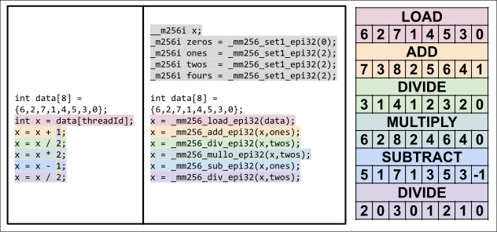

For example, in the diagram above, let's imagine eight threads evaluating the code snippet on the left, with each thread given a unique `threadId` between 0 and 7.
Since each index in the `data` array has a corresponding thread, all values in the array are processed by the expressions below the declaration of `data`.

Instead of distributing each index across a set of 8 threads, one could alternatively evaluate the snippet on the right in a single thread and achieve the same result.
This second snippet uses a SIMD vector to store what would be each thread's version of the `x` variable, using SIMD operations to process all versions of `x` in parallel.

### Auto-Vectorization

While SIMD may provide better performance, developing the SIMD solution in the previous figure would require the developer to know a lot about SIMD intrinsics, or to frequently reference x86 documentation.
Either scenario is not ideal, which is why most developers rely upon the **auto-vectorization** provided by compilers.

Auto-vectorization is a feature where compilers automatically identify pieces of non-SIMD code that could be accelerated through SIMD, and performs the necessary translation during compilation. While convenient, auto-vectorization is not perfect, and many operations that could be vectorized are often not vectorized when the corresponding code does not match the compiler's set of good-to-vectorize processing patterns.

### The Problem with Branching

Matching the functionality of threads with SIMD becomes more difficult once branching is introduced.
For example, in the code snippet shown in the diagram below, different threads apply a different sequence of operations to their `x` variable.

This code snippet could not be translated simply by matching operations with their SIMD equivalent, because only some versions of the `x` variable should undergo certain operations.
Some additional mechanism must be added to exclude specific elements of the vector from operations.

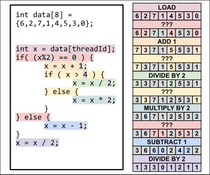

This mechanism is provided by masked SIMD instructions, as shown below.

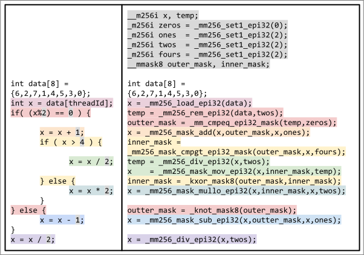

Notice that there are no flow control structures in the right code snippet; all values of `x` are provided as inputs and outputs to all operations.
Specific indexes in a vector can be excluded from the effects of a SIMD operation by setting the corresponding mask bit to zero.
So, by providing masks with one bits matching the threads that "belong" in the corresponding control structure, those control structures can be emulated.

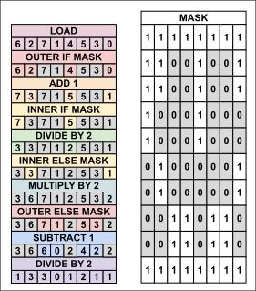

For each level of nesting in a thread's flow control structures, an additional mask needs to be tracked to manage which threads should be "active" in a given SIMD operation.
An example of this can be seen in the use of an `outer_mask` and `inner_mask` variable in the example code snippet.

If this stack of masks is not tracked, then information about which threads belong to which outer flow control structures could be lost.

### The Need for SIMT

#### SIMD is Hard, Masked SIMD is Harder

Understandably, most developers do not want to write code that uses a lot of masked SIMD intrinsics.
It requires specialized knowledge of the target architecture, and introduces a new set of masking-related bugs that can be difficult to track down.

Additionally, if no threads need to enter a particular branch of code, the developer would need to include actual flow control structures to selectively skip SIMD operations that are not required by any elements of the current vector.
If such opportunistic skipping is not provided, the resulting code could perform many SIMD operations with all-zero masks, wasting a significant amount of computing power.

#### Normal Compilers Won't Auto-Vectorize The Hardest-to-Vectorize Code

The difficulty of explicit SIMD programming makes the fallibility of auto-vectorization all the more tragic.
Compilers are in the perfect position to quickly and safely transform flow control structures into masked SIMD instructions.
However, unless there is a decent guarantee that the same piece of code needs to be executed many times, and unless the compiler can rely upon a versatile set of SIMD operations and masking capabilities, it does not make sense to have compilers vectorize by default.

#### A Solution: All SIMD, All The Time

A core issue with auto-vectorization on CPUs is that CPUs are meant to do a variety of work, not just the sort of work that executes many copies of the same function in parallel.
However, if a hardware platform was built explicitly for executing many identical functions in parallel and was designed to primarily execute SIMD operations, a compiler for that platform could safely assume auto-vectorization as a default.
With some effort, the hardware architects behind such a platform could accelerate and streamline the management of its "threads" and the masks that control their execution.

Fortunately, this type of hardware does exist, and you likely know of them as **Graphics Processing Units (GPUs)**.
While GPUs were originally created to quickly render CGI, the people developing GPU hardware kept adding features to make their processing more flexible.
As part of this incremental development, hardware designers eventually settled on this threads-through-SIMD approach {{footnote: as well as some more sophisticated variants}}.
With this, the capabilities of GPUs became so general that they could essentially perform any task that a CPU could, making them **General Purpose GPUs (GPGPUs)**.

Today, GPUs are used for many non-graphical applications.
Hence, in contexts where people want to refer to GPU hardware but emphasize its use in non-graphical contexts, they may refer to it as **Single-Instruction, Multiple-Thread (SIMT)** hardware.

## SIMT Processing Infrastructure

Modern GPUs organize memory and processing hardware hierarchically.

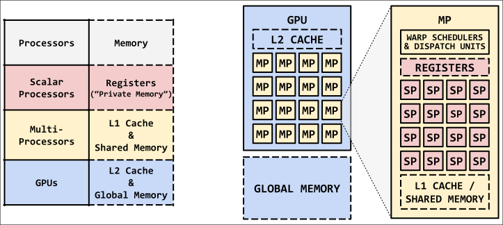

### The Hierarchy of Processing Hardware

The most fine-grained level of execution is performed by **scalar processors**, which are the processors that handle operations on individual elements in a vector.
Scalar processors are grouped into SIMD-style vector processors known as **multiprocessors (aka streaming multiprocessors)**, which can be thought of as a very specialized CPU core that mainly executes SIMD-style operations.

Like a normal CPU core, a multiprocessor only executes a single stream of instructions at any given time, using a program counter to track progress through that stream as well as to perform looping and branching.
Unlike a normal CPU, a multiprocessor does not skip any instructions unless no threads in its current vector need to evaluate the corresponding branch.
In cases where at least one thread must execute a particular branch, the multiprocessor automatically manages the masking required to preserve correctness.

Just as scalar processors are grouped into multiprocessors, GPUs are made up of multiple multiprocessors.

### The Hierarchy of Memory Hardware

Each layer of processing has a corresponding layer of memory.

During execution each thread stores its variables in a bank of registers.
This bank is referred to as **private memory**, since each thread can only access its own copy of the program's variables.

Likewise, each multiprocessor has a local bank of memory that can be accessed by any thread executing on that multiprocessor, but not by any threads outside the multiprocessor.
This is referred to as **shared memory**.

Finally, each GPU has its own random access memory that is accessible by any thread executing on any multiprocessor in the GPU.
This is referred to as **global memory**.

The bank that stores shared memory for a multiprocessor usually also serves as a cache for accesses to global memory.
Typically, the proportion of this bank used for shared memory or cache is chosen automatically, but developers may also configure their GPU software to allocate more or less of this bank as cache.
GPUs also frequently have an L2 cache that caches accesses to global memory, which is typically managed by a separate RAM chip.

### Units of Execution

As noted previously, the primary conceit of SIMT is that threads are processed in batches of parallel execution.

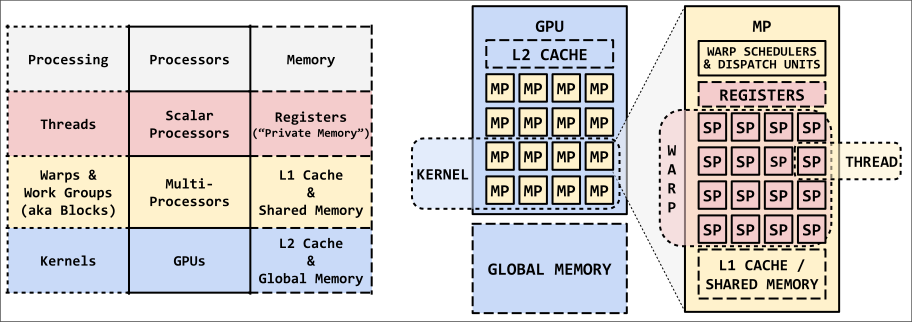

Each **thread** {{footnote: NVIDIA calls them **threads**, but AMD calls them **work units**}} is executed in a "team" referred to as a **warp** {{footnote: NVIDIA calls them **warps**, but AMD calls them **wavefronts**}}.
Within a warp, all threads are executed in **lockstep**, meaning that their execution is tied to the same program counter.
Hence, within a warp, no thread may advance to an instruction without all other threads advancing to that instruction.

Warps are also executed in a "team" of one or more warps called a **block** {{footnote: NVIDIA calls them **blocks**, but AMD calls them **work groups**.}}.
All warps within a specific block execute on the same multiprocessor. This has two major benefits:
- it allows the control unit of a multiprocessor to coordinate the execution of blocks, including synchronization between the warps of a block
- it allows warps within the same block to communicate through shared memory

Blocks are executed as a "team" of one or more blocks called a **kernel**, which represents the outermost level of execution in a GPU.
A kernel executing on a GPU is analogous to a process executing on a CPU.
Multiple kernels may execute concurrently on a GPU, sharing use of the GPU's multiprocessors.

### Divergence

Even with this sophisticated, multi-level processing infrastructure, GPUs are still limited by the fundamental trade-off of masked SIMD processing.

Whenever threads within the same warp take different paths through a program, the warp executes each path serially.
As each path is executed, threads that do not belong in that path are masked away, preventing the side effects of the executed instructions.

The phenomenon of multiple threads in the same warp taking different paths is called **divergence**.

#### Branching

For branching flow control structures, such as `if`/`else` statements or `switch` statements, each branch is evaluated serially, as shown in the diagram below.

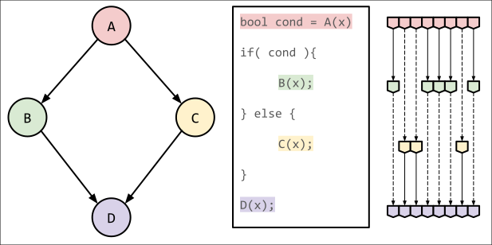

Hence, even if only one thread in a warp takes the `if` block of an `if`/`else` statement, all threads in that thread's warp must execute the contained instructions.
In cases where a particular branch is expensive but executed infrequently, if the few threads that need to take this branch are spread across many warps, all the threads in all of those warps must pay the cost of executing this expensive branch.

This is less than ideal, but this doesn't mean that a SIMT software developer must avoid branching at all costs.
Note that *warps only execute a branch if it has been taken by at least one of its threads*.
Hence, if the few threads that need to take an expensive branch are all packed into a small set of warps, very few threads would be forced to unnecessarily execute this branch.

#### Looping

For looping flow control structures, such as `while` and `for` loops, threads that have broken out of a loop will essentially "wait" at the bottom of the loop until all other threads in their warp have also broken from the loop.

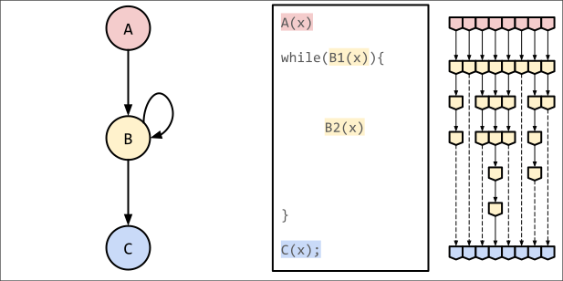

In cases where different threads in a warp require a different number of iterations, all threads in a warp need to pay the processing cost of following the thread with the highest iteration count.
As with branching flow control structures, this cost may be reduced if threads with similar iteration counts are grouped into the same warps.

## Issues with Memory

Compared to CPUs, GPUs have significantly more raw processing power.

For example, a top-of-the-line CPU, the [AMD Ryzen Threadripper PRO 7995WX](https://www.amd.com/en/products/cpu/amd-ryzen-threadripper-pro-7995wx) has 96 cores and allows for **192 threads** via simultaneous multithreading.
Meanwhile, the [Nvidia RTX 4090](https://www.nvidia.com/en-us/geforce/graphics-cards/40-series/rtx-4090/) has a whopping *16384 cores* (scalar processors), spread across 128 multiprocessors, with each MP supporting 1536 concurrent threads via simultaneous multithreading, for a total of **196608 threads**. Even after accounting for the lower clock rate of the RTX 4090, that is a staggering difference in processing power.

Of course, as with most things in computer science, this comes with trade-offs.
While GPUs have many, many more threads than CPUs, they don't have an equivalently large memory capacity or throughput.
In addition, while GPUs have an impressive amount of private/shared memory per streaming multiprocessor, the sheer number of threads supported by GPUs means that the amount of registers/cache per thread is not as high as a CPU thread could expect.

This reduces the appeal of GPU processing somewhat, because an abundance of processing power means nothing if the provided memory hardware cannot match the increased demand for data.
To squeeze more effective use out of the same memory throughput, modern GPUs apply some tricks to reduce effective latency and increase the effective number of accesses per memory fetch.

### Latency Hiding Through Hyper-threading

One major trick used by GPUs to more effectively use memory is **simultaneous multithreading (SMT)**, which we briefly mentioned in the above paragraph.

SMT, more commonly known by the Intel trademark *hyperthreading*, is the tracking of multiple execution contexts via hardware for execution on the same processor.
With SMT, when one thread of execution must wait for a memory access, a processor can quickly swap out that thread for another thread currently stored by the hardware, allowing the first thread to wait for its data while the second thread executes.
This technique essentially hides the latency of memory accesses by overlapping the latency with useful work.

While modern CPUs typically use SMT to track two threads per core, modern GPUs apply SMT on a mass scale, tracking several dozen warps per multiprocessor at a given time.
For example, as noted previously, an RTX 4090 can support 1536 threads (48 warps) per multiprocessor.

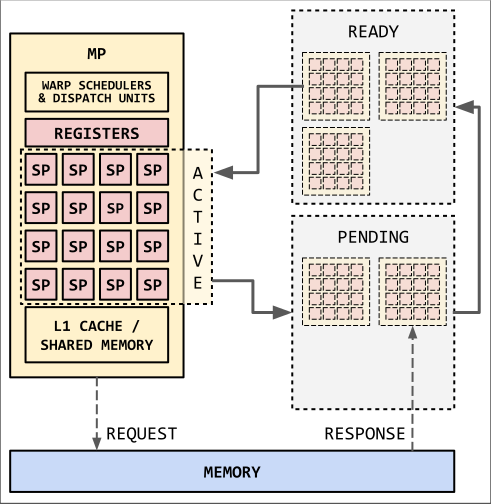

To facilitate this mass-scale SMT, GPUs apply a warp queuing system analogous to the waiting/ready queues used by CPU operating systems.
While one warp executes on a multiprocessor, all other warps assigned to that multiprocessor are either in a ready or pending queue.
Warps in the ready queue may be immediately scheduled onto the multiprocessor once the current executing warp needs to wait for an event.
Warps in the pending queue may not be scheduled onto the multiprocessor, as they are waiting for some event to occur (eg, a memory fetch).

With SMT, a GPU program does not need to account for the pure latency of memory fetches, but the latency that warps will effectively experience after being swapped out for the other warps on the multiprocessor.
This is important because GPU programs which have a small per-thread private/shared memory footprint can fit more warps onto that multiprocessor.
This means that programs with low local memory usage can experience less effective latency, because the memory latency would be hidden by a larger set of warps.

### Reducing Memory Fetches with Memory Coalescing

Like with CPU memory, memory accesses to global memory are usually handled on the granularity of cache lines.
To take advantage of this, modern GPUs perform **memory coalescing**.

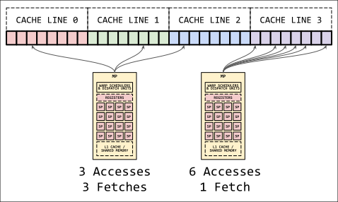

Under memory coalescing, multiple accesses to the same cache line by the same multiprocessor are combined into a single memory access.
Once the corresponding cache line has been fetched, the parts of the cache line that correspond to outstanding accesses are relayed to the corresponding threads.

With this hardware feature, where and when different locations of memory are accessed can matter beyond which data is currently cached.
Even if a series of accesses is guaranteed to miss a multiprocessor's cache across many cache lines, the accesses can be served more quickly if they are grouped by cache line.

## Issues with Synchronization

Since threads within a warp must execute in lockstep, the synchronization operations available to GPU programs are limited.
For example, if a mutex or condition primitive was made available on a GPU processing platform, how would it work?

One thread could not simply wait on the mutex or condition, since its execution progress must match the progress of the other threads in its warp.
To satisfy both the basic definition of a condition while keeping execution in lockstep, all threads in a warp would have to simultaneously wait on the condition, and all threads in that warp would have to be notified simultaneously.
Mutexes present an even greater challenge, since they should only be acquired by one thread and should only be released by the thread that acquired it.

Beyond this, there is a more fundamental problem: since GPUs have so many threads executing concurrently, guarding a global data structure behind a mutex, condition, or other synchronization primitive could lead to a *lot* of bottlenecking.
Imagine 196608 threads competing for access to a mutex; even if the computation between acquiring the mutex and releasing it was negligible, forcing so many threads to wait their turn for a resource would waste significant processing power.

However, GPU processing platforms do provide some limited synchronization capabilities, namely between threads in a block.

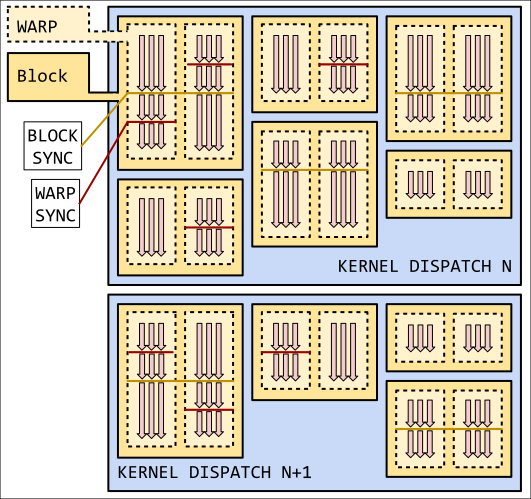

On platforms such as CUDA or HIP, developers can use block synchronization, where all threads in a block essentially wait on a built-in per-block "barrier".
This synchronization is accomplished through the use of multiprocessor ready/pending queues.
As the warps in a block arrive at a synchronization point, they are added to a pending queue until the final warp in the block arrives at the synchronization point.
Once this final warp arrives, all other warps waiting on the sync point are moved to the ready queue, thus completing the synchronization.

Some platforms, such as CUDA, apply clever tricks to allow for more flexible execution.
These tricks, while clever, can cause threads to drift out of sync with one-another.
To account for this, CUDA provides warp-level synchronization.

Finally, and rather strangely, it is possible to synchronize between threads in different blocks, but the most common method to accomplish this does not work as one may expect:
Instead of using ready/pending queues to delay warps, many developers simply save the current state of the kernel's work, stop the execution of the kernel, then launch a new kernel to continue the work of the previous kernel.

This may seem rather inefficient, but consider the time it would take to run all blocks up to the synchronization point and store them in their pending queues.
During this time, no other warps may use the hardware used to store the state of the pending warps, leading to lost performance.
By having warps save their work for a future warp then exit, that warp's "slot" on the GPU can be used by other warps that still have work to perform.
